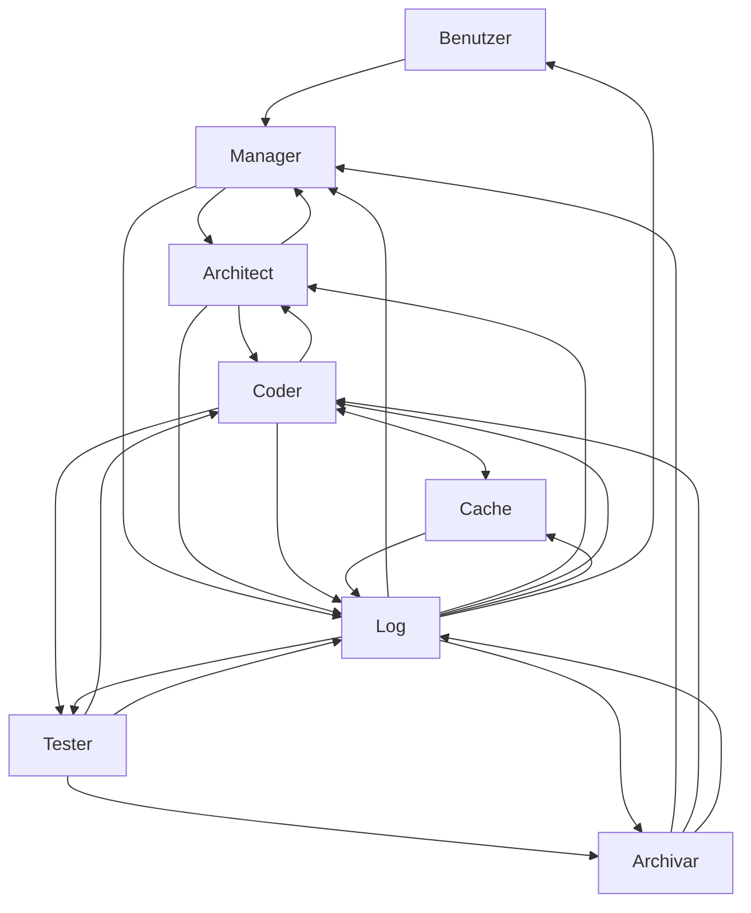
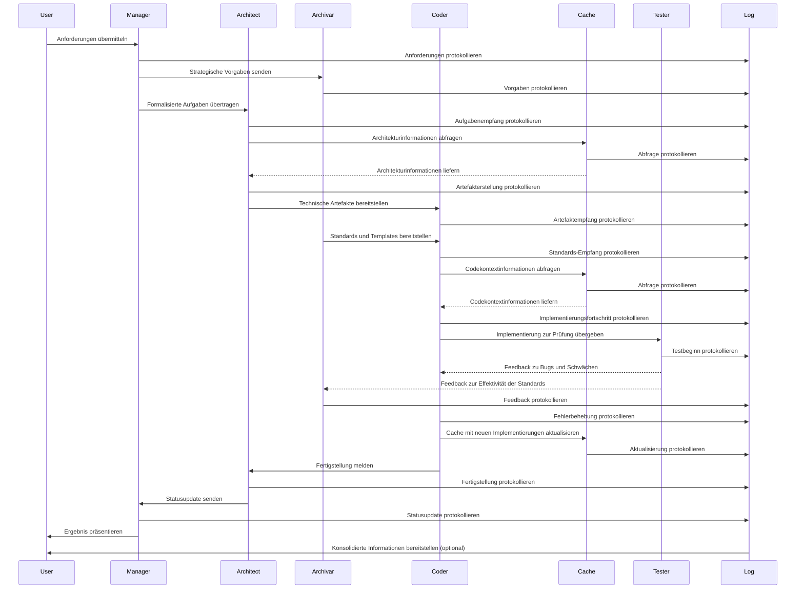
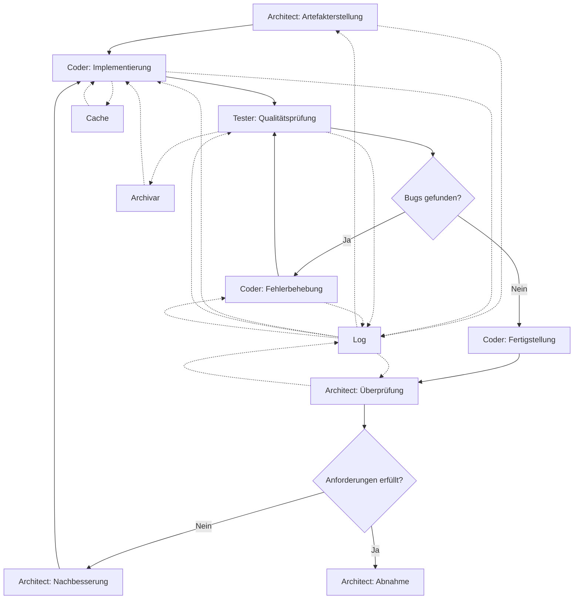
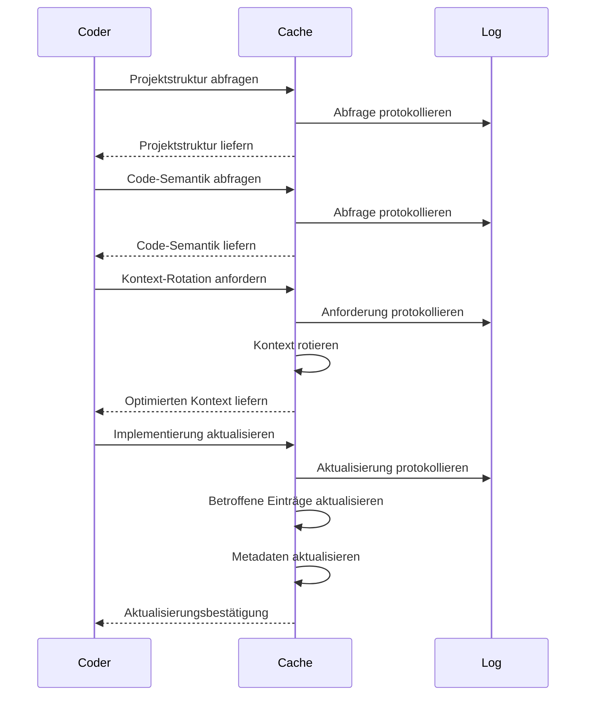

# AgentHive: Vollautonomes AI Coding System

Dieses Dokument beschreibt die Architektur und Implementierung des AgentHive-Systems, das ein vollautonomes AI Coding System mit verschiedenen spezialisierten Agenten darstellt. Das System nutzt den MINTY Cache als zentrale Wissenskomponente und den MINTY Logging Agent für die Protokollierung und Optimierung.

## 1. Überblick

Das AgentHive-System besteht aus mehreren spezialisierten Agenten, die zusammenarbeiten, um Coding-Aufgaben autonom zu lösen. Jeder Agent hat spezifische Verantwortlichkeiten und Schnittstellen zu anderen Agenten.



## 2. Agenten-Spezifikationen

### 2.1 Manager Agent (Platzhalter)

Der Manager Agent ist die Schnittstelle zwischen dem Benutzer und dem AgentHive-System.

**Verantwortlichkeiten:**
- Empfängt Benutzeranforderungen
- Formuliert und priorisiert Tasks
- Verhandelt Dringlichkeit und Ressourcen
- Identifiziert kritische Tasks via kritischer Pfade

**Schnittstellen:**
- **User**: Empfängt Anforderungen vom Benutzer
- **Architect**: Sendet formalisierte Tasks und empfängt Statusupdates
- **Archivar**: Sendet Anforderungsfeedback und strategische Vorgaben
- **Log**: Sendet und empfängt protokollierte Ereignisse

### 2.2 Architect Agent (MVP)

Der Architect Agent übersetzt die vom Manager definierten Tasks in technische Artefakte und stellt sicher, dass diese in die bestehende Infrastruktur integriert werden können.

**Verantwortlichkeiten:**
- Übersetzt Manager-Tasks in technische Artefakte
- Integriert Funktionen in bestehende Infrastruktur
- Sichert Mindeststandards für Codequalität und Architektur
- Erstellt detaillierte Pläne für die Implementierung
- Definiert Schnittstellen zwischen Komponenten
- Überwacht die Einhaltung von Architekturprinzipien

**Schnittstellen:**
- **Manager**: Empfängt Aufgaben und sendet Statusupdates
- **Coder**: Sendet technische Artefakte und empfängt Fertigstellungsbestätigungen
- **Log**: Sendet Statusupdates und Artefaktdetails

**Implementierungsdetails:**
```json
{
  "name": "ArchitectAgent",
  "version": "1.0.0",
  "capabilities": [
    "SystemAnalysis",
    "ArchitecturalDesign",
    "InterfaceDefinition",
    "QualityAssurance",
    "TechnicalDocumentation"
  ],
  "workingMode": {
    "inputAnalysis": {
      "taskDecomposition": true,
      "dependencyMapping": true,
      "constraintIdentification": true
    },
    "designPhase": {
      "componentDesign": true,
      "interfaceSpecification": true,
      "patternApplication": true
    },
    "documentationPhase": {
      "architecturalDiagrams": true,
      "componentSpecifications": true,
      "interfaceContracts": true
    },
    "qualityAssurance": {
      "designReview": true,
      "principleCompliance": true,
      "riskAssessment": true
    }
  },
  "outputFormats": [
    "MarkdownDocumentation",
    "JSONSpecification",
    "MermaidDiagrams",
    "CodeSkeletons"
  ],
  "integrations": {
    "cacheSystem": {
      "read": ["ProjectStructure", "CodeSemantics", "ArchitecturalPatterns"],
      "write": ["DesignDecisions", "ComponentSpecifications", "InterfaceDefinitions"]
    },
    "loggingSystem": {
      "metrics": ["DesignComplexity", "ComponentCohesion", "InterfaceCoupling"],
      "events": ["DesignDecision", "SpecificationUpdate", "QualityCheck"]
    }
  }
}
```

**Beispiel-Workflow:**
1. Empfang einer Task vom Manager
2. Analyse der bestehenden Systemarchitektur über den Cache
3. Erstellung eines Architekturplans für die neue Funktionalität
4. Definition von Komponenten und Schnittstellen
5. Erstellung von Code-Skeletten und Spezifikationen
6. Übergabe der technischen Artefakte an den Coder
7. Überwachung der Implementierung
8. Qualitätssicherung der fertigen Implementierung
9. Statusupdate an den Manager

### 2.3 Coder Agent (Vollständige Implementierung)

Der Coder Agent ist für die eigentliche Implementierung der vom Architect definierten technischen Artefakte verantwortlich. Er interagiert intensiv mit dem Cache-System und dem Tester.

**Verantwortlichkeiten:**
- Implementiert technische Artefakte autonom
- Programmiert gemäß erhaltenen Artefakten und Spezifikationen
- Interagiert mit Cache und Tester zur Optimierung
- Refaktoriert Code für bessere Qualität und Wartbarkeit
- Dokumentiert Code inline und extern
- Implementiert Tests für die eigene Implementierung
- Optimiert Code für Performance und Ressourceneffizienz

**Schnittstellen:**
- **Architect**: Empfängt Artefakte und sendet Fertigstellungsmeldungen
- **Cache**: Bidirektionaler Informationsaustausch für Codekontext und -semantik
- **Tester**: Sendet Implementierungsstatus und empfängt Bug-Feedback
- **Archivar**: Erhält technische Vorlagen und Standards
- **Log**: Sendet Implementierungsstatus und Ergebnisdetails

**Coding-Praktiken:**
1. **Clean Code Prinzipien**
   - Selbstdokumentierender Code durch aussagekräftige Benennungen
   - Einzelverantwortlichkeitsprinzip (SRP)
   - DRY (Don't Repeat Yourself)
   - KISS (Keep It Simple, Stupid)
   - Frühe Fehlerbehandlung und Validierung

2. **Testgetriebene Entwicklung (TDD)**
   - Schreiben von Tests vor der Implementierung
   - Kontinuierliche Testausführung
   - Refaktorierung nach erfolgreichen Tests

3. **Kontinuierliche Refaktorierung**
   - Regelmäßige Überprüfung und Verbesserung des Codes
   - Beseitigung von Code-Smells
   - Anwendung von Design Patterns wo sinnvoll

4. **Effiziente Cache-Nutzung**
   - Abfrage relevanter Codekontexte vor der Implementierung
   - Aktualisierung des Caches nach Änderungen
   - Nutzung von Code-Semantik für intelligente Implementierungsentscheidungen

5. **Fehlerbehandlung und Robustheit**
   - Defensive Programmierung
   - Umfassende Fehlerbehandlung
   - Logging von Fehlern und Warnungen

**Implementierungsdetails:**
```json
{
  "name": "CoderAgent",
  "version": "1.0.0",
  "capabilities": [
    "CodeImplementation",
    "Refactoring",
    "Testing",
    "Debugging",
    "Documentation",
    "Optimization"
  ],
  "supportedLanguages": [
    "PowerShell",
    "C#",
    "JavaScript",
    "Python",
    "Java"
  ],
  "codingStandards": {
    "naming": {
      "camelCase": ["variables", "parameters", "privateFields"],
      "PascalCase": ["classes", "interfaces", "publicProperties", "methods"],
      "UPPER_CASE": ["constants"]
    },
    "formatting": {
      "indentation": "spaces",
      "indentSize": 4,
      "maxLineLength": 120,
      "braceStyle": "Allman"
    },
    "documentation": {
      "requireMethodComments": true,
      "requireClassComments": true,
      "requireParameterDescriptions": true,
      "requireReturnDescriptions": true
    },
    "quality": {
      "maxMethodLength": 50,
      "maxParameterCount": 5,
      "maxClassLength": 500,
      "maxCyclomaticComplexity": 10
    }
  },
  "workingMode": {
    "implementationPhase": {
      "testFirst": true,
      "incrementalDevelopment": true,
      "continuousRefactoring": true
    },
    "testingPhase": {
      "unitTesting": true,
      "integrationTesting": true,
      "edgeCaseTesting": true
    },
    "optimizationPhase": {
      "performanceOptimization": true,
      "memoryOptimization": true,
      "codeCleanup": true
    }
  },
  "integrations": {
    "cacheSystem": {
      "read": ["ProjectStructure", "CodeSemantics", "CodePatterns", "TestPatterns"],
      "write": ["ImplementedCode", "TestResults", "PerformanceMetrics"]
    },
    "loggingSystem": {
      "metrics": ["CodeComplexity", "TestCoverage", "ImplementationTime", "BugCount"],
      "events": ["ImplementationStart", "TestExecution", "BugFix", "Refactoring", "ImplementationComplete"]
    }
  }
}
```

**Beispiel-Workflow:**
1. Empfang technischer Artefakte vom Architect
2. Abfrage relevanter Codekontexte vom Cache
3. Anwendung von Standards und Vorlagen vom Archivar
4. Erstellung von Tests basierend auf den Spezifikationen
5. Inkrementelle Implementierung mit kontinuierlicher Testausführung
6. Regelmäßige Refaktorierung zur Verbesserung der Codequalität
7. Dokumentation des Codes
8. Optimierung für Performance und Ressourceneffizienz
9. Übergabe an den Tester für umfassende Tests
10. Behebung von Bugs basierend auf Tester-Feedback
11. Aktualisierung des Caches mit neuen Implementierungen
12. Fertigstellungsmeldung an den Architect

### 2.4 Tester Agent (Platzhalter)

Der Tester Agent ist für die Qualitätssicherung der vom Coder implementierten Artefakte verantwortlich.

**Verantwortlichkeiten:**
- Testet implementierte Artefakte
- Gibt Feedback zu Bugs und Schwächen
- Führt verschiedene Testarten durch (Unit, Integration, System)
- Bewertet Codequalität und Performance

**Schnittstellen:**
- **Coder**: Empfängt Artefakte und sendet Fehler-/Bug-Feedback
- **Archivar**: Sendet Rückmeldungen zur Einhaltung und Effektivität der Konventionen
- **Log**: Sendet Testergebnisse und Feedback

### 2.5 Archivar Agent (Platzhalter)

Der Archivar Agent ist für die Entwicklung und Pflege von Konventionen, Templates und anderen Form- und Strukturstandards verantwortlich.

**Verantwortlichkeiten:**
- Entwickelt und pflegt Konventionen und Templates und andere Form- und Strukturstandards
- Stellt diese für alle Agenten bereit
- Integriert Feedback zur kontinuierlichen Optimierung
- Sichert Konsistenz und Qualität über alle Artefakte hinweg
- Dokumentiert Best Practices und Muster

**Schnittstellen:**
- **Manager**: Empfängt Anforderungsfeedback und strategische Vorgaben
- **Coder**: Stellt technische Vorlagen und Standards bereit
- **Tester**: Erhält Rückmeldungen zur Einhaltung und Effektivität der Konventionen
- **Log**: Dokumentiert alle Änderungen und Versionen

**Implementierungsdetails:**
```json
{
  "name": "ArchivarAgent",
  "version": "1.0.0",
  "capabilities": [
    "TemplateManagement",
    "StandardsDevelopment",
    "ConventionEnforcement",
    "PatternDocumentation",
    "BestPracticesCuration"
  ],
  "managedArtifacts": {
    "templates": [
      "CodeTemplates",
      "DocumentationTemplates",
      "TestTemplates",
      "ConfigurationTemplates"
    ],
    "standards": [
      "CodingStandards",
      "DocumentationStandards",
      "TestingStandards",
      "NamingConventions"
    ],
    "patterns": [
      "DesignPatterns",
      "ArchitecturalPatterns",
      "TestingPatterns",
      "DocumentationPatterns"
    ]
  },
  "workingMode": {
    "developmentPhase": {
      "standardsResearch": true,
      "templateCreation": true,
      "patternIdentification": true
    },
    "maintenancePhase": {
      "standardsUpdating": true,
      "templateRefining": true,
      "versionControl": true
    },
    "feedbackPhase": {
      "usageAnalysis": true,
      "effectivenessEvaluation": true,
      "improvementImplementation": true
    }
  },
  "integrations": {
    "cacheSystem": {
      "read": ["ProjectStructure", "CodeSemantics", "UsagePatterns"],
      "write": ["Templates", "Standards", "Conventions", "Patterns"]
    },
    "loggingSystem": {
      "metrics": ["StandardsCompliance", "TemplateUsage", "ConventionEffectiveness"],
      "events": ["StandardUpdate", "TemplateCreation", "ConventionRevision"]
    }
  }
}
```

**Beispiel-Workflow:**
1. Analyse bestehender Codebasen und Praktiken
2. Entwicklung von Standards und Konventionen
3. Erstellung von Templates für verschiedene Artefakttypen
4. Bereitstellung für andere Agenten
5. Sammlung von Feedback zur Nutzung und Effektivität
6. Kontinuierliche Verbesserung basierend auf Feedback
7. Dokumentation von Best Practices und Mustern
8. Versionierung und Verwaltung aller Standards und Templates

### 2.6 Cache Agent (Detaillierte Integration)

Der Cache Agent ist die zentrale Wissenskomponente des Systems, die Informationen speichert und bereitstellt.

**Verantwortlichkeiten:**
- Speichert und liefert informationsbezogene Daten
- Sichert schnellen und korrekten Zugriff auf Anforderungen
- Optimiert Speichernutzung durch differentielles Caching
- Implementiert proaktive Kontext-Rotation
- Sammelt und analysiert Metadaten
- Verbessert sich kontinuierlich durch Nutzungsmuster

**Schnittstellen:**
- **Coder**: Bidirektionaler Informationsaustausch
- **Architect**: Bereitstellung von Architekturinformationen
- **Log**: Sendet gespeicherte Daten und Zugriffslogs

**Implementierungsdetails:**
```json
{
  "name": "CacheAgent",
  "version": "1.0.0",
  "components": [
    "ProjectStructureCache",
    "CodeSemanticsCache",
    "ContextWindowManager",
    "LLMAPICache",
    "MetadataCache"
  ],
  "cacheStrategies": {
    "differentialCaching": true,
    "proactiveRotation": true,
    "metadataEnhancement": true,
    "priorityBasedEviction": true
  },
  "dataTypes": {
    "projectStructure": {
      "storage": "hierarchical",
      "indexing": "path-based",
      "compression": "moderate"
    },
    "codeSemantics": {
      "storage": "graph",
      "indexing": "symbol-based",
      "compression": "high"
    },
    "contextWindow": {
      "storage": "priority-queue",
      "indexing": "relevance-based",
      "compression": "very-high"
    },
    "apiResponses": {
      "storage": "key-value",
      "indexing": "hash-based",
      "compression": "low"
    },
    "metadata": {
      "storage": "document",
      "indexing": "multi-dimensional",
      "compression": "moderate"
    }
  },
  "integrations": {
    "loggingSystem": {
      "metrics": ["CacheHitRate", "ResponseTime", "MemoryUsage", "TokenSavings"],
      "events": ["CacheMiss", "CacheUpdate", "ContextRotation", "MetadataUpdate"]
    }
  }
}
```

**Integration mit dem Coder Agent:**
1. **Projektstruktur-Abfragen**
   - Coder fragt nach Dateien und Verzeichnissen
   - Cache liefert strukturierte Projektinformationen
   - Coder nutzt diese für Navigation und Kontextverständnis

2. **Code-Semantik-Abfragen**
   - Coder fragt nach Symbolen, Funktionen, Klassen
   - Cache liefert semantische Informationen und Beziehungen
   - Coder nutzt diese für intelligente Implementierungsentscheidungen

3. **Kontext-Management**
   - Coder teilt aktuellen Fokus mit
   - Cache rotiert Kontextinformationen proaktiv
   - Coder erhält optimierten Kontext für aktuelle Aufgabe

4. **Cache-Aktualisierung**
   - Coder sendet implementierte Änderungen
   - Cache aktualisiert betroffene Einträge
   - Cache aktualisiert Metadaten basierend auf Änderungen

5. **Lernende Optimierung**
   - Cache analysiert Nutzungsmuster des Coders
   - Cache optimiert Caching-Strategien
   - Coder profitiert von verbesserten Antwortzeiten und Relevanz

### 2.7 Log Agent (Bestehende Komponente)

Der Log Agent ist für die Protokollierung aller Systemaktivitäten verantwortlich und nutzt den bereits implementierten MINTY Logging Agent.

**Verantwortlichkeiten:**
- Protokolliert alle wesentlichen Informationen an definierten Schnittstellen
- Führt die Ergebnisse zusammen
- Verteilt konsolidierte Informationen an alle beteiligten Instanzen
- Sammelt Metriken für Optimierung und Analyse
- Ermöglicht Nachverfolgung von Entscheidungen und Aktionen

**Schnittstellen:**
- **Manager**: Empfang und Verteilung von Status- und Ereignislogs
- **Architect**: Empfang von Statusupdates und Artefakt-Logs
- **Coder**: Empfang von Implementierungs- und Fehlerlogs
- **Tester**: Empfang von Test- und Feedbacklogs
- **Archivar**: Empfang von Änderungen und Versionen der Standards und Templates
- **Cache**: Empfang von Datenzugriffs- und Speichervorgangslogs
- **User**: Optionaler Zugang zu konsolidierten Informationen

**Integration mit dem MINTY Logging Agent:**
```json
{
  "name": "LogAgent",
  "version": "1.0.0",
  "baseComponent": "MINTYLoggingAgent",
  "logCategories": [
    "ArchitecturalDecisions",
    "ImplementationEvents",
    "TestResults",
    "CacheOperations",
    "SystemMetrics",
    "UserInteractions",
    "StandardsChanges"
  ],
  "metricCollection": {
    "tokenUsage": true,
    "qualityMetrics": true,
    "performanceMetrics": true,
    "contextWindowUsage": true
  },
  "aggregation": {
    "realTimeAggregation": true,
    "historicalAnalysis": true,
    "trendDetection": true
  },
  "distribution": {
    "agentSpecificFiltering": true,
    "priorityBasedDelivery": true,
    "consolidatedReporting": true
  }
}
```

## 3. Workflow und Interaktionen

### 3.1 Grundlegender Workflow



### 3.2 Iterativer Entwicklungszyklus



### 3.3 Cache-Interaktionen



## 4. Implementierungsplan

### 4.1 Phase 1: Grundlegende Infrastruktur (2-3 Wochen)

1. **Cache-System Grundstruktur**
   - Implementierung der Verzeichnisstruktur
   - Basiskomponenten für Projektstruktur und Code-Semantik
   - Integration mit dem Logging Agent

2. **Coder Agent Basisimplementierung**
   - Definition der Schnittstellen
   - Implementierung der grundlegenden Coding-Praktiken
   - Integration mit dem Cache-System

3. **Architect Agent MVP**
   - Implementierung der Kernfunktionalitäten
   - Schnittstellen zum Coder Agent
   - Einfache Artefakterstellung

4. **Archivar Agent Basisstruktur**
   - Definition der Schnittstellen
   - Grundlegende Template-Verwaltung
   - Einfache Standards-Dokumentation

### 4.2 Phase 2: Erweiterte Funktionalität (2-3 Wochen)

1. **Cache-System Erweiterungen**
   - Implementierung des Context Window Managers
   - Differentielles Caching
   - Proaktive Kontext-Rotation

2. **Coder Agent Erweiterungen**
   - Erweiterte Coding-Praktiken
   - Verbesserte Test-Integration
   - Optimierte Cache-Nutzung

3. **Architect Agent Erweiterungen**
   - Verbesserte Artefakterstellung
   - Qualitätssicherungsmechanismen
   - Erweiterte Dokumentationsfunktionen

4. **Archivar Agent Erweiterungen**
   - Erweiterte Template-Verwaltung
   - Feedback-Integration
   - Versionierung von Standards

### 4.3 Phase 3: Integration und Optimierung (2-3 Wochen)

1. **Vollständige Integration**
   - Integration aller Komponenten
   - End-to-End-Workflows
   - Fehlerbehandlung und Robustheit

2. **Optimierung**
   - Performance-Optimierung
   - Token-Effizienz-Verbesserungen
   - Speicheroptimierung

3. **Tester Agent Basisimplementierung**
   - Grundlegende Testfunktionalitäten
   - Integration mit Coder und Log
   - Einfaches Feedback-System

### 4.4 Phase 4: Manager und Vollständigkeit (2-3 Wochen)

1. **Manager Agent Basisimplementierung**
   - Benutzerinteraktion
   - Aufgabenformalisierung
   - Integration mit Architect

2. **Systemtests und Feinabstimmung**
   - Umfassende Tests des Gesamtsystems
   - Feinabstimmung der Interaktionen
   - Optimierung der Workflows

3. **Dokumentation und Beispiele**
   - Umfassende Dokumentation
   - Beispiel-Workflows
   - Benutzerhandbuch

## 5. Erfolgsmetriken

Die Effektivität des AgentHive-Systems wird anhand der folgenden Metriken gemessen:

1. **Token-Effizienz**
   - Reduzierung des Token-Verbrauchs im Vergleich zur Baseline
   - Token-Verbrauch pro Aufgabenkomplexität
   - Token-Verbrauch pro Codebase-Größe

2. **Qualitätsmetriken**
   - Code-Korrektheit
   - Code-Lesbarkeit
   - Dokumentationsqualität
   - Testabdeckung
   - Einhaltung von Standards und Konventionen

3. **Performance-Metriken**
   - Antwortzeit
   - Aufgabenerledigungszeit
   - Cache-Trefferrate
   - Speicherverbrauch

4. **Skalierbarkeitsmetriken**
   - Performance bei wachsender Codebase
   - Performance bei steigender Aufgabenkomplexität
   - Performance bei mehreren gleichzeitigen Aufgaben

5. **Benutzererfahrungsmetriken**
   - Benutzerzufriedenheit
   - Aufgabenerfolgsrate
   - Iterationsanzahl
   - Lernkurve

