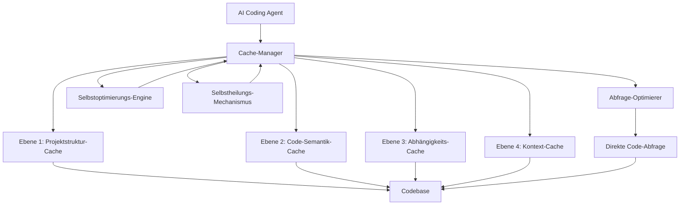
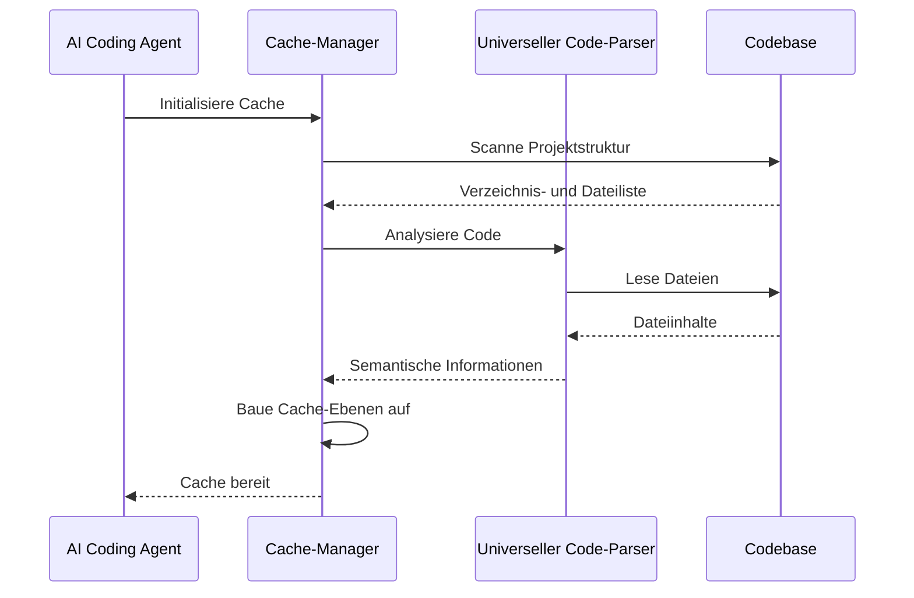
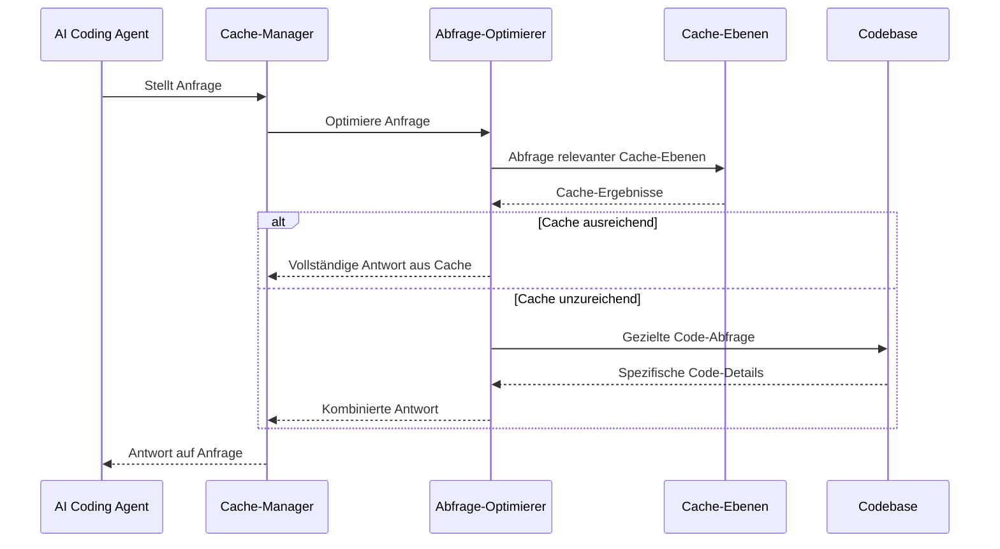
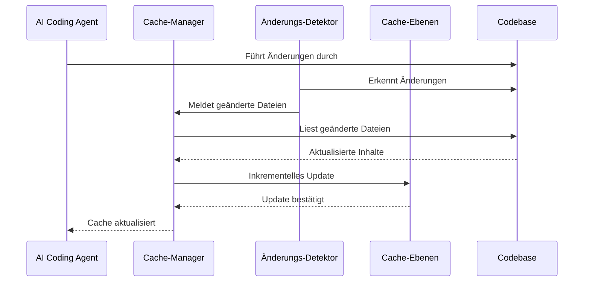
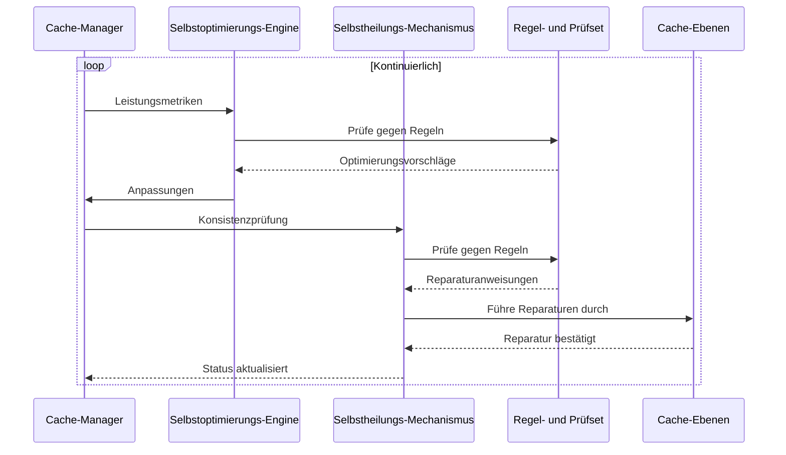
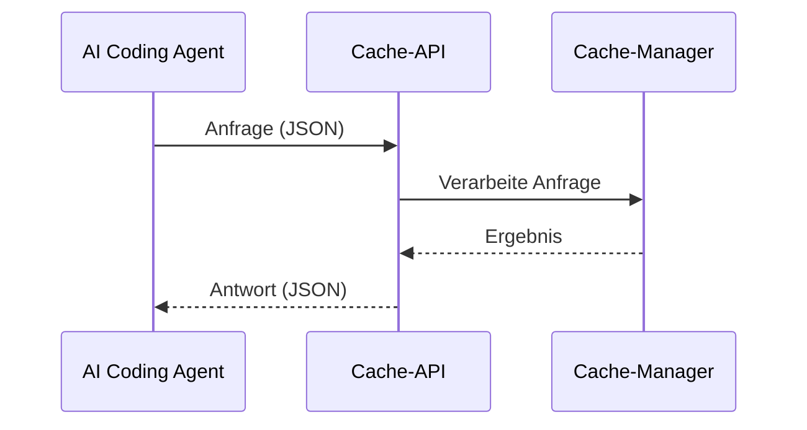
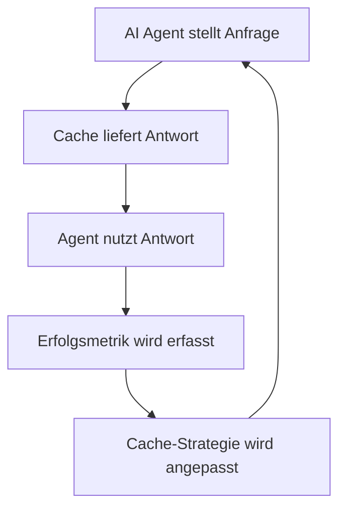

# MINTY Cache-System: Architektur und Implementierungsplan

## 1. Einführung und Ziele

Das MINTY Cache-System ist eine zentrale Komponente für vollautonome AI Coding Agents, die komplexe Aufgaben in verschiedenen Programmiersprachen selbstständig lösen können. Der Cache dient als Informationsaggregator, der Zusammenhänge, Strukturen und ähnliche Aspekte einer Codebase analysiert und speichert, um die Effizienz und Effektivität des AI Agents zu maximieren.

### 1.1 Hauptziele

1. **Universelle Einsetzbarkeit**: Sprachunabhängige Funktionalität für beliebige Codebasen
2. **Explizitheit und Vorhersagbarkeit**: Konsistente und zuverlässige Ergebnisse auch bei 10-facher Vergrößerung der Codebase
3. **Robustheit**: Fehlertoleranz und Stabilität unter verschiedenen Bedingungen
4. **Tokeneffizienz**: Minimierung der benötigten Tokens bei gleichbleibend hoher Qualität (≥90%)
5. **Performance**: Schnelle Verarbeitung und Antwortzeiten
6. **Autonomie**: Selbstoptimierung und Selbstheilung basierend auf einem wirksamen Regel- und Prüfset

## 2. Architektur des Cache-Systems

Das MINTY Cache-System verwendet eine mehrschichtige Architektur, die verschiedene Abstraktionsebenen der Codebase repräsentiert und sprachunabhängig arbeitet.



### 2.1 Cache-Ebenen

#### Ebene 1: Projektstruktur-Cache
- **Inhalt**: Verzeichnisstruktur, Dateien, Modulorganisation, Namensräume
- **Format**: Hierarchische Baumstruktur mit Metadaten
- **Nutzen**: Schnelles Navigieren in der Codebase, Identifizieren relevanter Dateien
- **Sprachunabhängigkeit**: Basiert auf Dateisystemstrukturen, unabhängig von Programmiersprachen

#### Ebene 2: Code-Semantik-Cache
- **Inhalt**: Klassen, Funktionen, Methoden, Variablen, Typen, Signaturen
- **Format**: Symbolische Repräsentation mit Typ- und Beziehungsinformationen
- **Nutzen**: Verstehen der Code-Komponenten ohne vollständigen Code zu analysieren
- **Sprachunabhängigkeit**: Verwendet abstrakte Syntax-Bäume und generische Symbolrepräsentationen

#### Ebene 3: Abhängigkeits-Cache
- **Inhalt**: Import/Export-Beziehungen, Aufrufgraphen, Datenfluss
- **Format**: Gerichteter Graph mit gewichteten Kanten
- **Nutzen**: Verstehen von Zusammenhängen und Auswirkungen von Änderungen
- **Sprachunabhängigkeit**: Modelliert Abhängigkeiten auf abstrakter Ebene, adaptierbar an verschiedene Sprachparadigmen

#### Ebene 4: Kontext-Cache
- **Inhalt**: Dokumentation, Kommentare, Commit-Historien, Muster, Konventionen
- **Format**: Semantisch indizierte Textblöcke mit Relevanzwerten
- **Nutzen**: Verstehen der Intention und des Kontexts des Codes
- **Sprachunabhängigkeit**: Basiert auf natürlicher Sprache und generischen Metadaten

### 2.2 Cache-Manager

Der Cache-Manager ist die zentrale Komponente, die:
- Die verschiedenen Cache-Ebenen koordiniert
- Abfragen des AI Agents interpretiert und an die passende Cache-Ebene weiterleitet
- Cache-Aktualisierungen verwaltet
- Inkonsistenzen erkennt und behebt
- Die Sprachunabhängigkeit durch Abstraktionsschichten gewährleistet

### 2.3 Abfrage-Optimierer

Der Abfrage-Optimierer:
- Analysiert Anfragen des AI Agents
- Entscheidet, ob Informationen aus dem Cache ausreichen oder direkter Code-Zugriff nötig ist
- Formuliert optimierte Abfragen an die Cache-Ebenen
- Kombiniert Informationen aus verschiedenen Cache-Ebenen
- Passt Strategien an verschiedene Programmiersprachen und Paradigmen an

### 2.4 Selbstoptimierungs-Engine

Die Selbstoptimierungs-Engine:
- Überwacht die Performance und Effektivität des Cache-Systems
- Identifiziert Muster in den Abfragen und Ergebnissen
- Passt Cache-Strategien basierend auf Nutzungsstatistiken an
- Optimiert die Speichernutzung und Abfragegeschwindigkeit
- Verbessert kontinuierlich die Sprachunterstützung durch Lernen aus Interaktionen

### 2.5 Selbstheilungs-Mechanismus

Der Selbstheilungs-Mechanismus:
- Erkennt Inkonsistenzen und Fehler im Cache
- Führt automatische Reparaturen durch
- Rekonstruiert beschädigte Cache-Teile
- Implementiert Fallback-Strategien bei Fehlern
- Stellt die Integrität des Caches nach Systemausfällen wieder her

## 3. Funktionsweise des Cache-Systems

### 3.1 Initialisierung und Aufbau



1. **Projektanalyse**: Scannen der gesamten Codebase zur Identifizierung von Dateien und Strukturen
2. **Spracherkennung**: Automatische Erkennung der verwendeten Programmiersprachen
3. **Semantische Analyse**: Parsen des Codes zur Extraktion von Symbolen, Typen und Beziehungen
4. **Abhängigkeitsanalyse**: Aufbau eines Abhängigkeitsgraphen
5. **Kontextanalyse**: Extraktion von Dokumentation und Kontext

### 3.2 Abfrageprozess



1. **Anfrage-Analyse**: Verstehen der Anfrage des AI Agents
2. **Cache-Abfrage**: Abrufen relevanter Informationen aus den Cache-Ebenen
3. **Lückenanalyse**: Identifizieren fehlender Informationen
4. **Gezielte Code-Abfrage**: Bei Bedarf gezieltes Nachladen spezifischer Code-Details
5. **Antwort-Synthese**: Zusammenführen der Informationen zu einer kohärenten Antwort

### 3.3 Cache-Aktualisierung



1. **Änderungserkennung**: Überwachung von Änderungen in der Codebase
2. **Inkrementelle Updates**: Gezielte Aktualisierung nur der betroffenen Cache-Bereiche
3. **Konsistenzprüfung**: Sicherstellung der Konsistenz zwischen den Cache-Ebenen
4. **Versionierung**: Tracking von Cache-Zuständen für Rollback-Möglichkeiten

### 3.4 Selbstoptimierung und Selbstheilung



1. **Leistungsüberwachung**: Kontinuierliche Erfassung von Performance-Metriken
2. **Regelbasierte Analyse**: Vergleich mit definierten Leistungs- und Qualitätsregeln
3. **Adaptive Optimierung**: Automatische Anpassung von Cache-Strategien
4. **Konsistenzprüfung**: Regelmäßige Überprüfung der Cache-Integrität
5. **Selbstreparatur**: Automatische Behebung erkannter Probleme

## 4. Technische Implementierung

### 4.1 Datenstrukturen

#### Projektstruktur-Cache
```json
{
  "root": {
    "type": "directory",
    "name": "project-root",
    "language_stats": {
      "python": 45,
      "javascript": 30,
      "html": 15,
      "css": 10
    },
    "children": [
      {
        "type": "directory",
        "name": "src",
        "children": [...]
      },
      {
        "type": "file",
        "name": "README.md",
        "language": "markdown",
        "size": 1024,
        "hash": "a1b2c3d4..."
      }
    ]
  }
}
```

#### Code-Semantik-Cache
```json
{
  "symbols": {
    "Symbol1": {
      "type": "class|function|variable|etc",
      "file": "path/to/file",
      "language": "detected_language",
      "members": ["member1", "member2"],
      "properties": ["prop1", "prop2"],
      "parents": ["Parent1"],
      "interfaces": ["Interface1"],
      "signature_hash": "e5f6g7h8..."
    }
  }
}
```

#### Abhängigkeits-Cache
```json
{
  "imports": {
    "path/to/file1": ["import1", "import2"],
    "path/to/file2": ["import3", "import4"]
  },
  "calls": {
    "Symbol1.method1": ["Symbol2.method2", "Symbol3.method3"],
    "Symbol2.method2": ["Symbol4.method4"]
  },
  "data_flow": {
    "Symbol1.property1": ["Symbol2.method2", "Symbol3.property2"]
  }
}
```

#### Kontext-Cache
```json
{
  "documentation": {
    "Symbol1": {
      "description": "Beschreibung des Symbols",
      "author": "Autor",
      "examples": ["Beispiel 1", "Beispiel 2"]
    }
  },
  "conventions": {
    "naming": {
      "classes": "PascalCase|camelCase|snake_case|etc",
      "methods": "camelCase|snake_case|etc"
    },
    "patterns": ["Pattern1", "Pattern2"]
  }
}
```

### 4.2 Sprachunabhängige Parser-Strategie

Um die universelle Einsetzbarkeit zu gewährleisten, verwendet das Cache-System einen mehrschichtigen Parsing-Ansatz:

1. **Basisschicht**: Einfache Textanalyse und Mustererkennungen für alle Dateitypen
2. **Sprachspezifische Parser**: Modulare Parser für gängige Programmiersprachen
3. **Heuristischer Parser**: Für unbekannte oder nicht vollständig unterstützte Sprachen
4. **Erweiterbare Architektur**: Möglichkeit zur Hinzufügung neuer Sprachmodule

Die Parser-Strategie basiert auf folgenden Prinzipien:
- **Gemeinsame Abstraktionen**: Fokus auf sprachübergreifende Konzepte
- **Inkrementelle Verfeinerung**: Zunächst grobe Analyse, dann Verfeinerung nach Bedarf
- **Fallback-Mechanismen**: Robuste Verarbeitung auch bei unvollständiger Sprachunterstützung

### 4.3 Regel- und Prüfset

Das Regel- und Prüfset definiert Standards für:

1. **Performance-Regeln**:
   - Maximale Antwortzeit für Cache-Abfragen
   - Maximaler Speicherverbrauch
   - Optimale Cache-Größe pro Ebene

2. **Qualitätsregeln**:
   - Minimale Übereinstimmung mit direkten Code-Abfragen (≥90%)
   - Vollständigkeit der extrahierten Informationen
   - Konsistenz zwischen Cache-Ebenen

3. **Selbstoptimierungs-Regeln**:
   - Kriterien für Cache-Invalidierung
   - Schwellenwerte für adaptive Strategien
   - Lernraten für kontinuierliche Verbesserung

4. **Selbstheilungs-Regeln**:
   - Erkennungsmuster für Inkonsistenzen
   - Reparaturstrategien für verschiedene Fehlertypen
   - Wiederherstellungsprioritäten

### 4.4 Implementierungssprachen und -technologien

- **Kernkomponenten**: C# für Performance-kritische Teile
- **Skriptkomponenten**: PowerShell für Integration mit MINTutil und anderen Systemen
- **Datenbank**: SQLite für strukturierte Daten, LiteDB für Dokumentenspeicherung
- **Indexierung**: Lucene.NET für Volltextsuche und semantische Indizierung
- **Parsing**: Tree-sitter für sprachübergreifendes Parsing mit Erweiterbarkeit

## 5. Integration mit dem AI Coding Agent

### 5.1 Kommunikationsprotokoll



Die Kommunikation erfolgt über eine definierte JSON-API mit folgenden Hauptendpunkten:
- `/query`: Für Informationsabfragen
- `/update`: Für Cache-Aktualisierungen
- `/status`: Für Cache-Statusinformationen
- `/stats`: Für Nutzungsstatistiken
- `/optimize`: Für manuelle Optimierungsanweisungen
- `/repair`: Für manuelle Reparaturanweisungen

### 5.2 Prompt-Engineering

Der AI Agent wird mit speziellen Prompts ausgestattet, die:
- Die effiziente Nutzung des Caches fördern
- Die Formulierung präziser Abfragen unterstützen
- Die Interpretation der Cache-Antworten erleichtern
- Die Sprachunabhängigkeit berücksichtigen

### 5.3 Feedback-Schleife



- **Erfolgsmetriken**: Messung der Nützlichkeit von Cache-Antworten
- **Adaptive Strategien**: Anpassung der Cache-Strategien basierend auf Erfolgsmetriken
- **Kontinuierliches Lernen**: Verbesserung der Cache-Effektivität über Zeit
- **Sprachspezifische Optimierungen**: Anpassung an die Besonderheiten verschiedener Programmiersprachen

## 6. Leistungsoptimierung

### 6.1 Tokeneffizienz

- **Komprimierte Repräsentation**: Effiziente Kodierung von Code-Strukturen
- **Selektive Detaillierung**: Nur relevante Details werden zurückgegeben
- **Progressive Verfeinerung**: Zunächst grobe Übersicht, dann Details bei Bedarf
- **Kontextbewusstes Caching**: Priorisierung von Informationen basierend auf Abfragekontext

### 6.2 Performance-Optimierung

- **Indexierung**: Schneller Zugriff auf häufig abgefragte Informationen
- **Parallelisierung**: Gleichzeitige Verarbeitung mehrerer Cache-Ebenen
- **Vorausschauendes Caching**: Vorladen wahrscheinlich benötigter Informationen
- **Lazy Loading**: Verzögertes Laden von Details nur bei Bedarf

### 6.3 Skalierbarkeit

- **Verteilte Architektur**: Möglichkeit zur Verteilung auf mehrere Knoten
- **Hierarchisches Caching**: Lokale und globale Cache-Ebenen
- **Dynamische Ressourcenzuweisung**: Anpassung an Projektgröße und -komplexität
- **Inkrementelle Skalierung**: Fähigkeit, mit wachsenden Codebasen mitzuwachsen

## 7. Robustheit und Fehlertoleranz

### 7.1 Fehlerbehandlung

- **Graceful Degradation**: Bei Cache-Fehlern Rückfall auf direkte Code-Abfragen
- **Selbstheilung**: Automatische Reparatur inkonsistenter Cache-Zustände
- **Fehlerprotokollierung**: Detaillierte Logs für Diagnose und Verbesserung
- **Isolierte Fehler**: Fehler in einem Cache-Bereich beeinträchtigen nicht das Gesamtsystem

### 7.2 Konsistenzprüfung

- **Periodische Validierung**: Regelmäßige Überprüfung der Cache-Konsistenz
- **Checksummen**: Erkennung von Datenkorruption
- **Versionskontrolle**: Tracking von Cache-Zuständen und Code-Versionen
- **Transaktionale Updates**: Atomare Aktualisierungen zur Vermeidung inkonsistenter Zustände

## 8. Implementierungsplan

### Phase 1: Grundlegende Infrastruktur (2-3 Wochen)
- Einrichtung des MINTY\cache\ Verzeichnisses
- Entwicklung der Cache-Datenstrukturen
- Implementierung des Cache-Managers
- Basisintegration mit dem AI Agent

### Phase 2: Kernfunktionalität (3-4 Wochen)
- Implementierung der vier Cache-Ebenen
- Entwicklung des Abfrage-Optimierers
- Implementierung der Aktualisierungsmechanismen
- Entwicklung des sprachunabhängigen Parsing-Systems

### Phase 3: Selbstoptimierung und Selbstheilung (2-3 Wochen)
- Implementierung des Regel- und Prüfsets
- Entwicklung der Selbstoptimierungs-Engine
- Implementierung des Selbstheilungs-Mechanismus
- Integration der Feedback-Schleife

### Phase 4: Optimierung und Robustheit (2-3 Wochen)
- Performance-Optimierung
- Implementierung der Fehlertoleranz
- Skalierbarkeitsverbesserungen
- Umfassende Tests mit verschiedenen Programmiersprachen

### Phase 5: Integration und Tests (2-3 Wochen)
- Vollständige Integration mit dem AI Agent
- Umfassende Tests mit verschiedenen Codebasen
- Feinabstimmung basierend auf Testresultaten
- Dokumentation und Bereitstellung

## 9. Evaluierung und Metriken

### 9.1 Leistungsmetriken

- **Tokenreduktion**: Prozentuale Reduzierung der benötigten Tokens im Vergleich zur direkten Code-Analyse
- **Antwortzeit**: Zeit bis zur Bereitstellung einer Antwort
- **Genauigkeit**: Übereinstimmung der Cache-basierten Antworten mit direkten Code-Analysen (Ziel: ≥90%)
- **Skalierbarkeit**: Leistung bei wachsender Codebase-Größe (bis zu 10x)
- **Sprachunabhängigkeit**: Effektivität über verschiedene Programmiersprachen hinweg

### 9.2 Testszenarien

- **Verschiedene Programmiersprachen**: Tests mit Java, Python, C#, JavaScript, TypeScript, Go, Rust, etc.
- **Verschiedene Projektgrößen**: Von kleinen (10K LOC) bis sehr großen (1M+ LOC) Projekten
- **Verschiedene Änderungsraten**: Tests mit statischen und hochdynamischen Codebasen
- **Verschiedene Abfragetypen**: Von einfachen Strukturabfragen bis zu komplexen semantischen Analysen
- **Verschiedene Projekttypen**: Monolithen, Microservices, Bibliotheken, Frameworks, etc.

## 10. Zusammenfassung und Ausblick

Das MINTY Cache-System wird die Explizitheit und Vorhersagbarkeit des AI Coding Agents signifikant verbessern, auch bei stark wachsenden Codebasen. Durch die mehrschichtige Architektur, intelligente Abfrageoptimierung, Selbstoptimierung und robuste Fehlertoleranz wird eine hohe Effizienz bei minimalen Tokenkosten erreicht.

Die sprachunabhängige Konzeption ermöglicht die universelle Einsetzbarkeit in verschiedenen Projekten und Umgebungen, während die lose Kopplung mit MINTutil die Flexibilität für andere Anwendungsfälle gewährleistet.

Zukünftige Erweiterungsmöglichkeiten umfassen:
- Integration mit IDEs und Entwicklungsumgebungen
- Unterstützung für Team-Collaboration und Multi-Agent-Szenarien
- Erweiterung um maschinelles Lernen für adaptive Cache-Strategien
- Integration mit Code-Generierungs- und Refactoring-Tools
- Spezialisierte Module für besonders komplexe Programmiersprachen oder Frameworks
