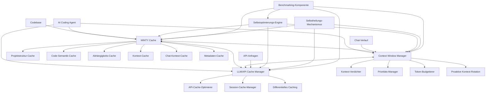
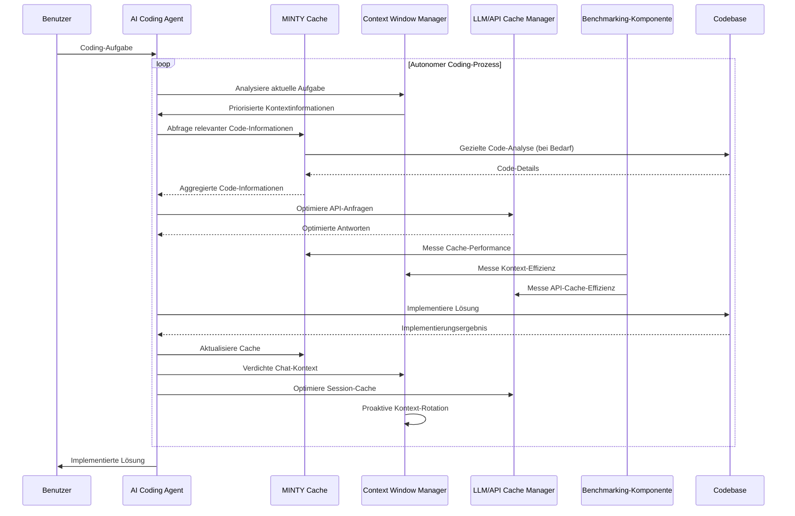

# MINTY Cache-System: Integrierte Architektur für vollautonomes AI Coding

## 1. Überblick und Ziele

Das MINTY Cache-System ist eine zentrale Komponente für vollautonome AI Coding Agents, die komplexe Aufgaben in verschiedenen Programmiersprachen selbstständig lösen können. Es integriert verschiedene Cache-Ebenen und Optimierungsmechanismen, um maximale Effizienz, Explizitheit und Vorhersagbarkeit zu gewährleisten.

### 1.1 Hauptziele

1. **Universelle Einsetzbarkeit**: Sprachunabhängige Funktionalität für beliebige Codebasen
2. **Explizitheit und Vorhersagbarkeit**: Konsistente und zuverlässige Ergebnisse auch bei 10-facher Vergrößerung der Codebase
3. **Robustheit**: Fehlertoleranz und Stabilität unter verschiedenen Bedingungen
4. **Tokeneffizienz**: Minimierung der benötigten Tokens bei gleichbleibend hoher Qualität (≥90%)
5. **Performance**: Schnelle Verarbeitung und Antwortzeiten
6. **Autonomie**: Selbstoptimierung und Selbstheilung basierend auf einem wirksamen Regel- und Prüfset
7. **Kontinuierliche Verbesserung**: Sowohl der Cache als auch der Gesamtprozess verbessern sich kontinuierlich selbst

## 2. Integrierte Cache-Architektur

Das System integriert drei Hauptcache-Komponenten, die zusammenarbeiten, um die Tokeneffizienz zu maximieren:



### 2.1 MINTY Cache

Der MINTY Cache analysiert und speichert Informationen über die Codebase:

- **Projektstruktur-Cache**: Verzeichnisstruktur, Dateien, Modulorganisation
- **Code-Semantik-Cache**: Klassen, Funktionen, Methoden, Variablen, Typen
- **Abhängigkeits-Cache**: Import/Export-Beziehungen, Aufrufgraphen, Datenfluss
- **Kontext-Cache**: Dokumentation, Kommentare, Muster, Konventionen
- **Chat-Kontext-Cache**: Verdichtete Informationen aus dem Chat-Verlauf
- **Metadaten-Cache** (Neu): Metainformationen über den Code (Größe, Änderungshäufigkeit, Komplexität)

### 2.2 Context Window Manager

Der Context Window Manager optimiert die Nutzung des LLM-Kontextfensters:

- **Kontext-Verdichter**: Analysiert und verdichtet den Chat-Kontext in regelmäßigen Intervallen
- **Prioritäts-Manager**: Priorisiert Informationen basierend auf Relevanz und Aktualität
- **Token-Budgetierer**: Verwaltet das Token-Budget für verschiedene Kontextteile
- **Proaktive Kontext-Rotation** (Neu): Rotiert Kontextinformationen proaktiv basierend auf vorhergesagten Anforderungen

### 2.3 LLM/API Cache Manager

Der LLM/API Cache Manager optimiert die Nutzung des vom LLM-Anbieter bereitgestellten Caches:

- **API-Cache-Optimierer**: Maximiert die Wiederverwendung von API-Anfragen
- **Session-Cache-Manager**: Verwaltet den Session-Cache (aktuell 172.3k Tokens)
- **Differentielles Caching** (Neu): Speichert nur Unterschiede statt vollständiger Kopien

### 2.4 Integrierte Selbstoptimierung

Die Selbstoptimierungs-Engine überwacht und verbessert kontinuierlich alle Cache-Komponenten:

- **Performance-Monitoring**: Erfasst Metriken zu Antwortzeiten, Tokenverbrauch und Trefferquoten
- **Adaptive Strategien**: Passt Cache-Strategien basierend auf Nutzungsmustern an
- **Lernende Algorithmen**: Verbessert Vorhersagen und Priorisierungen über Zeit
- **Cross-Cache-Optimierung**: Koordiniert die Optimierung über alle Cache-Ebenen hinweg

### 2.5 Integrierte Selbstheilung

Der Selbstheilungs-Mechanismus gewährleistet die Robustheit des Gesamtsystems:

- **Fehlerüberwachung**: Erkennt Inkonsistenzen und Fehler in allen Cache-Komponenten
- **Automatische Reparatur**: Behebt erkannte Probleme ohne menschliches Eingreifen
- **Fallback-Strategien**: Implementiert alternative Vorgehensweisen bei Ausfällen
- **Konsistenzprüfung**: Stellt die Integrität aller Cache-Komponenten sicher

### 2.6 Benchmarking-Komponente (Neu)

Die integrierte Benchmarking-Komponente misst und vergleicht kontinuierlich verschiedene Caching-Strategien:

- **Strategie-Vergleich**: Vergleicht die Leistung verschiedener Caching-Strategien in Echtzeit
- **A/B-Testing**: Führt kontrollierte Experimente mit verschiedenen Strategien durch
- **Leistungsmetriken**: Erfasst detaillierte Metriken zu Antwortzeiten, Tokenverbrauch und Trefferquoten
- **Dynamische Strategieauswahl**: Wählt automatisch die optimale Strategie basierend auf Benchmarking-Ergebnissen
- **Kontinuierliche Optimierung**: Passt Strategien basierend auf Langzeittrends an

## 3. Vollautonomer AI Coding Prozess

Der vollautonome AI Coding Prozess integriert alle Cache-Komponenten in einen effizienten Workflow:



### 3.1 Prozessschritte

1. **Aufgabenanalyse**: Verstehen der Coding-Aufgabe und Identifizierung der benötigten Informationen
2. **Kontextoptimierung**: Priorisierung und Verdichtung relevanter Kontextinformationen
3. **Informationsaggregation**: Sammlung relevanter Informationen aus allen Cache-Ebenen
4. **Lösungsplanung**: Entwicklung einer Lösungsstrategie basierend auf aggregierten Informationen
5. **Implementierung**: Umsetzung der Lösung mit kontinuierlicher Feedback-Schleife
6. **Cache-Aktualisierung**: Aktualisierung aller Cache-Komponenten mit neuen Erkenntnissen
7. **Selbstoptimierung**: Kontinuierliche Verbesserung des Prozesses basierend auf Ergebnissen
8. **Proaktive Rotation**: Vorausschauende Rotation von Kontextinformationen

### 3.2 Tokeneffizienzmaximierung

Der Prozess maximiert die Tokeneffizienz durch:

- **Selektive Informationsauswahl**: Nur relevante Informationen werden in den Kontext geladen
- **Progressive Detaillierung**: Zunächst grobe Übersicht, dann Details bei Bedarf
- **Kontext-Verdichtung**: Regelmäßige Komprimierung des Chat-Kontextes
- **Cache-Priorisierung**: Bevorzugung von Cache-Informationen gegenüber Rohdaten
- **API-Cache-Optimierung**: Maximale Wiederverwendung von API-Anfragen
- **Token-Budgetierung**: Dynamische Zuweisung von Token-Budgets basierend auf Prioritäten
- **Differentielles Caching**: Speicherung nur der Unterschiede statt vollständiger Kopien
- **Proaktive Kontext-Rotation**: Vorausschauende Rotation von Kontextinformationen

### 3.3 Qualitätssicherung

Der Prozess gewährleistet hohe Qualität durch:

- **Konsistenzprüfungen**: Validierung der Lösungen gegen definierte Qualitätskriterien
- **Selbsttests**: Automatische Tests der implementierten Lösungen
- **Feedback-Integration**: Kontinuierliche Verbesserung basierend auf Ergebnissen
- **Explizite Dokumentation**: Klare Dokumentation von Entscheidungen und Implementierungen
- **Musteranalyse**: Erkennung und Anwendung bewährter Muster und Best Practices
- **Benchmarking-basierte Optimierung**: Kontinuierliche Verbesserung basierend auf Leistungsmessungen

## 4. Technische Implementierung

### 4.1 Datenstrukturen

#### MINTY Cache mit Metadaten
```json
{
  "project_structure": { /* Hierarchische Projektstruktur */ },
  "code_semantics": { /* Symbolische Code-Repräsentation */ },
  "dependencies": { /* Abhängigkeitsgraphen */ },
  "context": { /* Dokumentation und Konventionen */ },
  "chat_context": { /* Verdichteter Chat-Verlauf */ },
  "metadata": {
    "files": {
      "path/to/file.js": {
        "size": 1024,
        "change_frequency": 0.05,
        "complexity": 12,
        "last_modified": "2025-03-24T18:30:00Z",
        "importance_score": 0.87
      }
    },
    "symbols": {
      "Symbol1": {
        "usage_count": 42,
        "complexity": 8,
        "change_frequency": 0.02,
        "importance_score": 0.93
      }
    }
  }
}
```

#### Differentielles Caching
```json
{
  "base_version": {
    "id": "v1.0",
    "content": "/* Vollständiger Inhalt der Basisversion */"
  },
  "diffs": [
    {
      "id": "v1.1",
      "parent": "v1.0",
      "changes": [
        {
          "type": "insert",
          "position": 120,
          "content": "// Neuer Code"
        },
        {
          "type": "delete",
          "position": 250,
          "length": 30
        }
      ]
    }
  ]
}
```

#### Proaktive Kontext-Rotation
```json
{
  "rotation_strategy": {
    "trigger_conditions": {
      "context_size_threshold": 80000,
      "time_threshold": 1800,
      "topic_change_threshold": 0.7
    },
    "priority_rules": [
      {
        "content_type": "task_definition",
        "retention_policy": "always_keep"
      },
      {
        "content_type": "recent_decisions",
        "retention_policy": "keep_last_n",
        "n": 5
      },
      {
        "content_type": "code_context",
        "retention_policy": "importance_based",
        "threshold": 0.6
      }
    ],
    "prediction_model": {
      "type": "markov_chain",
      "state_variables": ["current_task", "recent_queries", "code_focus"]
    }
  }
}
```

#### Benchmarking-Komponente
```json
{
  "active_experiments": [
    {
      "id": "exp-001",
      "description": "Vergleich verschiedener Verdichtungsalgorithmen",
      "variants": [
        {
          "id": "var-a",
          "algorithm": "semantic_clustering",
          "parameters": { /* Parameter */ }
        },
        {
          "id": "var-b",
          "algorithm": "importance_based_filtering",
          "parameters": { /* Parameter */ }
        }
      ],
      "metrics": [
        "token_reduction",
        "information_retention",
        "processing_time"
      ],
      "results": [
        {
          "timestamp": "2025-03-24T18:45:00Z",
          "variant": "var-a",
          "token_reduction": 0.72,
          "information_retention": 0.94,
          "processing_time": 120
        }
      ]
    }
  ],
  "historical_data": { /* Historische Benchmarking-Daten */ }
}
```

### 4.2 Algorithmen

#### Differentielles Caching
1. **Basisversion-Identifikation**: Identifizierung stabiler Basisversionen für Differenzbildung
2. **Diff-Generierung**: Effiziente Berechnung von Unterschieden zwischen Versionen
3. **Diff-Kompression**: Optimierte Speicherung von Unterschieden
4. **Rekonstruktion**: Schnelle Rekonstruktion vollständiger Versionen aus Diffs
5. **Garbage Collection**: Periodische Konsolidierung von Diffs zur Optimierung

#### Proaktive Kontext-Rotation
1. **Nutzungsmuster-Analyse**: Identifizierung von Mustern in der Kontextnutzung
2. **Vorhersagemodell**: Vorhersage zukünftig benötigter Kontextinformationen
3. **Prioritätsbasierte Rotation**: Rotation basierend auf vorhergesagten Prioritäten
4. **Trigger-Erkennung**: Identifizierung optimaler Zeitpunkte für Rotation
5. **Adaptive Rotationsstrategie**: Anpassung der Rotationsstrategie basierend auf Feedback

#### Metadaten-Caching
1. **Metadaten-Extraktion**: Extraktion relevanter Metadaten aus dem Code
2. **Wichtigkeitsberechnung**: Berechnung von Wichtigkeitswerten für Code-Elemente
3. **Änderungsverfolgung**: Tracking von Änderungshäufigkeiten und -mustern
4. **Komplexitätsanalyse**: Berechnung von Komplexitätsmetriken
5. **Metadaten-basierte Priorisierung**: Nutzung von Metadaten für Cache-Entscheidungen

#### Benchmarking
1. **Experiment-Design**: Definition von Experimenten zum Vergleich von Strategien
2. **Metrik-Erfassung**: Sammlung relevanter Leistungsmetriken
3. **Statistische Analyse**: Auswertung von Experimentergebnissen
4. **Strategie-Auswahl**: Auswahl optimaler Strategien basierend auf Benchmarks
5. **Kontinuierliche Optimierung**: Laufende Anpassung basierend auf Benchmarking-Ergebnissen

### 4.3 Implementierungssprachen und -technologien

- **Kernkomponenten**: C# für Performance-kritische Teile
- **Skriptkomponenten**: PowerShell für Integration mit MINTutil
- **Datenbank**: SQLite für strukturierte Daten, LiteDB für Dokumentenspeicherung
- **Indexierung**: Lucene.NET für Volltextsuche und semantische Indizierung
- **Parsing**: Tree-sitter für sprachübergreifendes Parsing
- **NLP**: SpaCy oder NLTK für die Verarbeitung natürlicher Sprache
- **Diff-Algorithmen**: LibGit2Sharp für effiziente Diff-Berechnung
- **Benchmarking**: BenchmarkDotNet für präzise Leistungsmessungen

## 5. Implementierungsplan mit frühem Nutzen

Der Implementierungsplan folgt einem inkrementellen Ansatz, der frühen Nutzen priorisiert:

### Phase 1: Grundlegende Infrastruktur mit frühem Nutzen (2-3 Wochen)
- Einrichtung des MINTY\cache\ Verzeichnisses
- Implementierung des Basis-MINTY-Cache mit Fokus auf Projektstruktur und Code-Semantik
- Einfache Metadaten-Erfassung für frühe Optimierungen
- Grundlegende Integration mit dem AI Agent für sofortigen Nutzen

### Phase 2: Kontext-Optimierung und Differentielles Caching (2-3 Wochen)
- Implementierung des Context Window Managers
- Entwicklung des Kontext-Verdichters
- Implementierung des differentiellen Cachings für effiziente Speicherung
- Integration der proaktiven Kontext-Rotation

### Phase 3: LLM/API Cache-Optimierung und Benchmarking (2-3 Wochen)
- Implementierung des LLM/API Cache Managers
- Entwicklung der Benchmarking-Komponente
- Integration aller Cache-Komponenten
- Erste A/B-Tests verschiedener Strategien

### Phase 4: Selbstoptimierung und Selbstheilung (2-3 Wochen)
- Implementierung des Regel- und Prüfsets
- Entwicklung der Selbstoptimierungs-Engine
- Implementierung des Selbstheilungs-Mechanismus
- Integration der Feedback-Schleife

### Phase 5: Vollautonomer Coding-Prozess und Feinabstimmung (2-3 Wochen)
- Entwicklung des vollständigen Agent-Scripts für Cache-Nutzung
- Integration aller Komponenten in einen nahtlosen Prozess
- Umfassende Tests und Benchmarking
- Feinabstimmung basierend auf realen Nutzungsdaten

## 6. Evaluierung und Metriken

### 6.1 Leistungsmetriken

- **Tokenreduktion**: Prozentuale Reduzierung der benötigten Tokens (Ziel: 90%)
- **Antwortzeit**: Zeit bis zur Bereitstellung einer Antwort
- **Genauigkeit**: Übereinstimmung mit direkten Code-Analysen (Ziel: ≥90%)
- **Skalierbarkeit**: Leistung bei wachsender Codebase (bis zu 10x)
- **Selbstverbesserung**: Messbare Verbesserung über Zeit
- **Speichereffizienz**: Reduzierung des Speicherbedarfs durch differentielles Caching
- **Rotationseffizienz**: Effektivität der proaktiven Kontext-Rotation

### 6.2 Testszenarien

- **Verschiedene Programmiersprachen**: Tests mit Java, Python, C#, JavaScript, etc.
- **Verschiedene Projektgrößen**: Von kleinen (10K LOC) bis sehr großen (1M+ LOC) Projekten
- **Verschiedene Änderungsraten**: Tests mit statischen und hochdynamischen Codebasen
- **Verschiedene Abfragetypen**: Von einfachen Strukturabfragen bis zu komplexen semantischen Analysen
- **Verschiedene Caching-Strategien**: Vergleich verschiedener Strategien in realen Szenarien

## 7. Zusammenfassung

Das erweiterte MINTY Cache-System mit differenziellem Caching, proaktiver Kontext-Rotation, Metadaten-Caching, integrierter Benchmarking-Komponente und inkrementeller Implementierung mit frühem Nutzen bildet die Grundlage für einen vollautonomen, tokeneffizienten, hochqualitativen, vorhersagbaren, robusten und performanten AI Coding Prozess.

Durch die kontinuierliche Selbstoptimierung und Selbstheilung verbessert sich das System stetig und passt sich an wachsende Codebasen und sich ändernde Anforderungen an. Die Integration aller Cache-Ebenen und die intelligente Verdichtung des Chat-Kontextes ermöglichen eine beispiellose Effizienz bei der Verarbeitung großer Codebasen, während die Qualität und Vorhersagbarkeit der Ergebnisse gewährleistet bleibt.

Die vorgeschlagenen Optimierungen - differentielles Caching, proaktive Kontext-Rotation, Metadaten-Caching, integrierte Benchmarking-Komponente und inkrementelle Implementierung mit frühem Nutzen - bieten erhebliche Verbesserungen bei minimalem Mehraufwand und maximieren den Nutzen des Systems von Anfang an.
