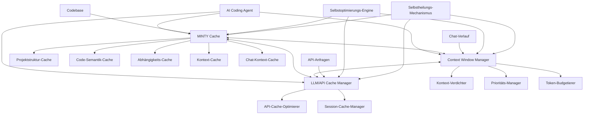
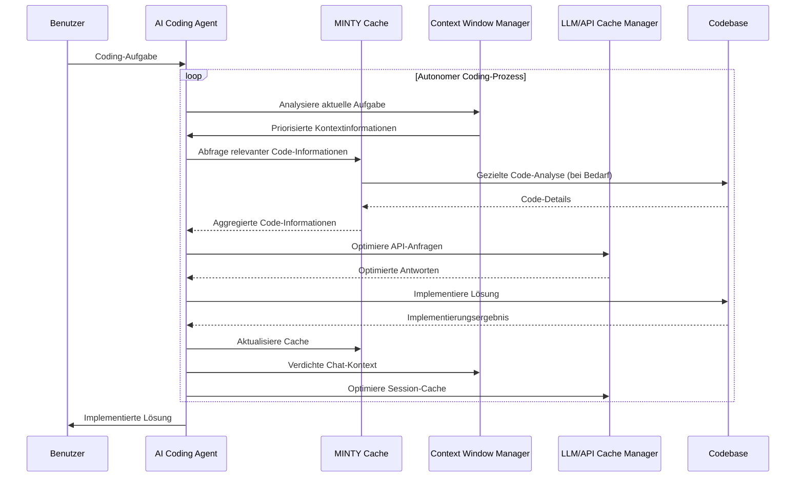

# MINTY Cache-System: Integrierte Architektur für vollautonomes AI Coding

## 1. Überblick und Ziele

Das MINTY Cache-System ist eine zentrale Komponente für vollautonome AI Coding Agents, die komplexe Aufgaben in verschiedenen Programmiersprachen selbstständig lösen können. Es integriert verschiedene Cache-Ebenen und Optimierungsmechanismen, um maximale Effizienz, Explizitheit und Vorhersagbarkeit zu gewährleisten.

### 1.1 Hauptziele

1. **Universelle Einsetzbarkeit**: Sprachunabhängige Funktionalität für beliebige Codebasen
2. **Explizitheit und Vorhersagbarkeit**: Konsistente und zuverlässige Ergebnisse auch bei 10-facher Vergrößerung der Codebase
3. **Robustheit**: Fehlertoleranz und Stabilität unter verschiedenen Bedingungen
4. **Tokeneffizienz**: Minimierung der benötigten Tokens bei gleichbleibend hoher Qualität (≥90%)
5. **Performance**: Schnelle Verarbeitung und Antwortzeiten
6. **Autonomie**: Selbstoptimierung und Selbstheilung basierend auf einem wirksamen Regel- und Prüfset
7. **Kontinuierliche Verbesserung**: Sowohl der Cache als auch der Gesamtprozess verbessern sich kontinuierlich selbst

## 2. Integrierte Cache-Architektur

Das System integriert drei Hauptcache-Komponenten, die zusammenarbeiten, um die Tokeneffizienz zu maximieren:



### 2.1 MINTY Cache

Der MINTY Cache analysiert und speichert Informationen über die Codebase:

- **Projektstruktur-Cache**: Verzeichnisstruktur, Dateien, Modulorganisation
- **Code-Semantik-Cache**: Klassen, Funktionen, Methoden, Variablen, Typen
- **Abhängigkeits-Cache**: Import/Export-Beziehungen, Aufrufgraphen, Datenfluss
- **Kontext-Cache**: Dokumentation, Kommentare, Muster, Konventionen
- **Chat-Kontext-Cache**: Verdichtete Informationen aus dem Chat-Verlauf

### 2.2 Context Window Manager

Der Context Window Manager optimiert die Nutzung des LLM-Kontextfensters:

- **Kontext-Verdichter**: Analysiert und verdichtet den Chat-Kontext in regelmäßigen Intervallen
- **Prioritäts-Manager**: Priorisiert Informationen basierend auf Relevanz und Aktualität
- **Token-Budgetierer**: Verwaltet das Token-Budget für verschiedene Kontextteile

### 2.3 LLM/API Cache Manager

Der LLM/API Cache Manager optimiert die Nutzung des vom LLM-Anbieter bereitgestellten Caches:

- **API-Cache-Optimierer**: Maximiert die Wiederverwendung von API-Anfragen
- **Session-Cache-Manager**: Verwaltet den Session-Cache (aktuell 172.3k Tokens)

### 2.4 Integrierte Selbstoptimierung

Die Selbstoptimierungs-Engine überwacht und verbessert kontinuierlich alle Cache-Komponenten:

- **Performance-Monitoring**: Erfasst Metriken zu Antwortzeiten, Tokenverbrauch und Trefferquoten
- **Adaptive Strategien**: Passt Cache-Strategien basierend auf Nutzungsmustern an
- **Lernende Algorithmen**: Verbessert Vorhersagen und Priorisierungen über Zeit
- **Cross-Cache-Optimierung**: Koordiniert die Optimierung über alle Cache-Ebenen hinweg

### 2.5 Integrierte Selbstheilung

Der Selbstheilungs-Mechanismus gewährleistet die Robustheit des Gesamtsystems:

- **Fehlerüberwachung**: Erkennt Inkonsistenzen und Fehler in allen Cache-Komponenten
- **Automatische Reparatur**: Behebt erkannte Probleme ohne menschliches Eingreifen
- **Fallback-Strategien**: Implementiert alternative Vorgehensweisen bei Ausfällen
- **Konsistenzprüfung**: Stellt die Integrität aller Cache-Komponenten sicher

## 3. Vollautonomer AI Coding Prozess

Der vollautonome AI Coding Prozess integriert alle Cache-Komponenten in einen effizienten Workflow:



### 3.1 Prozessschritte

1. **Aufgabenanalyse**: Verstehen der Coding-Aufgabe und Identifizierung der benötigten Informationen
2. **Kontextoptimierung**: Priorisierung und Verdichtung relevanter Kontextinformationen
3. **Informationsaggregation**: Sammlung relevanter Informationen aus allen Cache-Ebenen
4. **Lösungsplanung**: Entwicklung einer Lösungsstrategie basierend auf aggregierten Informationen
5. **Implementierung**: Umsetzung der Lösung mit kontinuierlicher Feedback-Schleife
6. **Cache-Aktualisierung**: Aktualisierung aller Cache-Komponenten mit neuen Erkenntnissen
7. **Selbstoptimierung**: Kontinuierliche Verbesserung des Prozesses basierend auf Ergebnissen

### 3.2 Tokeneffizienzmaximierung

Der Prozess maximiert die Tokeneffizienz durch:

- **Selektive Informationsauswahl**: Nur relevante Informationen werden in den Kontext geladen
- **Progressive Detaillierung**: Zunächst grobe Übersicht, dann Details bei Bedarf
- **Kontext-Verdichtung**: Regelmäßige Komprimierung des Chat-Kontextes
- **Cache-Priorisierung**: Bevorzugung von Cache-Informationen gegenüber Rohdaten
- **API-Cache-Optimierung**: Maximale Wiederverwendung von API-Anfragen
- **Token-Budgetierung**: Dynamische Zuweisung von Token-Budgets basierend auf Prioritäten

### 3.3 Qualitätssicherung

Der Prozess gewährleistet hohe Qualität durch:

- **Konsistenzprüfungen**: Validierung der Lösungen gegen definierte Qualitätskriterien
- **Selbsttests**: Automatische Tests der implementierten Lösungen
- **Feedback-Integration**: Kontinuierliche Verbesserung basierend auf Ergebnissen
- **Explizite Dokumentation**: Klare Dokumentation von Entscheidungen und Implementierungen
- **Musteranalyse**: Erkennung und Anwendung bewährter Muster und Best Practices

## 4. Technische Implementierung

### 4.1 Datenstrukturen

#### MINTY Cache
```json
{
  "project_structure": { /* Hierarchische Projektstruktur */ },
  "code_semantics": { /* Symbolische Code-Repräsentation */ },
  "dependencies": { /* Abhängigkeitsgraphen */ },
  "context": { /* Dokumentation und Konventionen */ },
  "chat_context": { /* Verdichteter Chat-Verlauf */ }
}
```

#### Context Window Management
```json
{
  "current_window": {
    "total_tokens": 92200,
    "used_tokens": 17100,
    "available_tokens": 75100,
    "priority_segments": [
      {
        "type": "task_definition",
        "tokens": 1200,
        "priority": "high"
      },
      {
        "type": "code_context",
        "tokens": 8500,
        "priority": "medium"
      },
      {
        "type": "chat_history",
        "tokens": 7400,
        "priority": "variable"
      }
    ]
  },
  "condensed_segments": [
    {
      "original_tokens": 15000,
      "condensed_tokens": 3000,
      "information_retention": 0.92
    }
  ]
}
```

#### LLM/API Cache
```json
{
  "session_cache": {
    "total_tokens": 1100000,
    "used_tokens": 172300,
    "hit_rate": 0.78
  },
  "request_patterns": [
    {
      "pattern_hash": "a1b2c3d4...",
      "frequency": 42,
      "average_tokens": 1500
    }
  ],
  "optimization_strategies": [
    {
      "name": "request_batching",
      "enabled": true,
      "efficiency_gain": 0.23
    }
  ]
}
```

### 4.2 Algorithmen

#### Kontext-Verdichtung
1. **Thematische Segmentierung**: Identifizierung zusammenhängender Themenblöcke
2. **Wichtigkeitsanalyse**: Bewertung der Relevanz einzelner Informationen
3. **Redundanzerkennung**: Eliminierung redundanter Informationen
4. **Semantische Kompression**: Verdichtung semantisch ähnlicher Informationen
5. **Temporale Gewichtung**: Höhere Gewichtung neuerer Informationen

#### Cache-Optimierung
1. **Zugriffsfrequenz-Analyse**: Identifizierung häufig abgefragter Informationen
2. **Abhängigkeitsbasierte Vorhersage**: Vorhersage benötigter Informationen
3. **Inkrementelle Updates**: Gezielte Aktualisierung nur geänderter Bereiche
4. **Adaptive Caching-Strategien**: Anpassung an Nutzungsmuster
5. **Cross-Cache-Koordination**: Optimierung über alle Cache-Ebenen hinweg

#### Selbstoptimierung
1. **Performance-Metrik-Erfassung**: Sammlung von Leistungsdaten
2. **Musteranalyse**: Erkennung von Nutzungs- und Effizienzmustern
3. **Regelbasierte Anpassung**: Automatische Anpassung basierend auf Regeln
4. **Feedback-Integration**: Lernen aus Erfolgen und Misserfolgen
5. **A/B-Testing**: Vergleich verschiedener Strategien zur Identifizierung der besten

### 4.3 Implementierungssprachen und -technologien

- **Kernkomponenten**: C# für Performance-kritische Teile
- **Skriptkomponenten**: PowerShell für Integration mit MINTutil
- **Datenbank**: SQLite für strukturierte Daten, LiteDB für Dokumentenspeicherung
- **Indexierung**: Lucene.NET für Volltextsuche und semantische Indizierung
- **Parsing**: Tree-sitter für sprachübergreifendes Parsing
- **NLP**: SpaCy oder NLTK für die Verarbeitung natürlicher Sprache

## 5. Implementierungsplan

### Phase 1: Grundlegende Infrastruktur (2-3 Wochen)
- Einrichtung des MINTY\cache\ Verzeichnisses
- Entwicklung der Cache-Datenstrukturen
- Implementierung des Cache-Managers
- Basisintegration mit dem AI Agent

### Phase 2: Integrierte Cache-Komponenten (3-4 Wochen)
- Implementierung des MINTY Cache
- Entwicklung des Context Window Managers
- Implementierung des LLM/API Cache Managers
- Integration aller Cache-Komponenten

### Phase 3: Selbstoptimierung und Selbstheilung (2-3 Wochen)
- Implementierung des Regel- und Prüfsets
- Entwicklung der Selbstoptimierungs-Engine
- Implementierung des Selbstheilungs-Mechanismus
- Integration der Feedback-Schleife

### Phase 4: Vollautonomer Coding-Prozess (2-3 Wochen)
- Entwicklung des Agent-Scripts für Cache-Nutzung
- Implementierung des vollautonomen Coding-Workflows
- Integration aller Komponenten in einen nahtlosen Prozess
- Optimierung der Tokeneffizienz und Qualitätssicherung

### Phase 5: Tests und Feinabstimmung (2-3 Wochen)
- Umfassende Tests mit verschiedenen Codebasen und Sprachen
- Feinabstimmung aller Komponenten basierend auf Testergebnissen
- Dokumentation und Bereitstellung
- Einrichtung kontinuierlicher Verbesserungsmechanismen

## 6. Evaluierung und Metriken

### 6.1 Leistungsmetriken

- **Tokenreduktion**: Prozentuale Reduzierung der benötigten Tokens (Ziel: 90%)
- **Antwortzeit**: Zeit bis zur Bereitstellung einer Antwort
- **Genauigkeit**: Übereinstimmung mit direkten Code-Analysen (Ziel: ≥90%)
- **Skalierbarkeit**: Leistung bei wachsender Codebase (bis zu 10x)
- **Selbstverbesserung**: Messbare Verbesserung über Zeit

### 6.2 Testszenarien

- **Verschiedene Programmiersprachen**: Tests mit Java, Python, C#, JavaScript, etc.
- **Verschiedene Projektgrößen**: Von kleinen (10K LOC) bis sehr großen (1M+ LOC) Projekten
- **Verschiedene Änderungsraten**: Tests mit statischen und hochdynamischen Codebasen
- **Verschiedene Abfragetypen**: Von einfachen Strukturabfragen bis zu komplexen semantischen Analysen

## 7. Zusammenfassung

Das integrierte MINTY Cache-System mit Context Window und LLM/API Cache Management bildet die Grundlage für einen vollautonomen, tokeneffizienten, hochqualitativen, vorhersagbaren, robusten und performanten AI Coding Prozess. Durch die kontinuierliche Selbstoptimierung und Selbstheilung verbessert sich das System stetig und passt sich an wachsende Codebasen und sich ändernde Anforderungen an.

Die Integration aller Cache-Ebenen und die intelligente Verdichtung des Chat-Kontextes ermöglichen eine beispiellose Effizienz bei der Verarbeitung großer Codebasen, während die Qualität und Vorhersagbarkeit der Ergebnisse gewährleistet bleibt. Das System ist universell einsetzbar und kann mit beliebigen Programmiersprachen und Projekttypen arbeiten.
