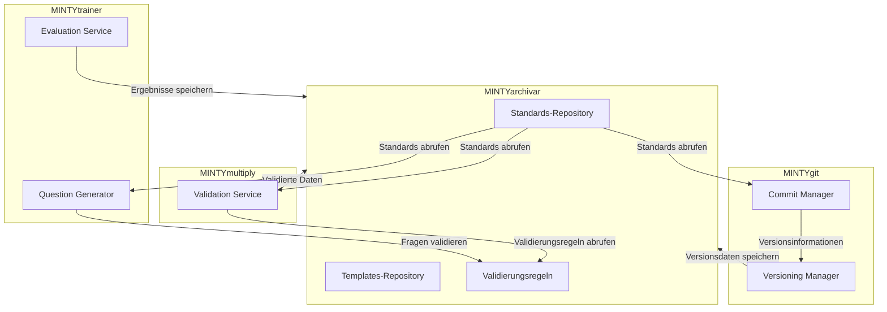

# Standardisierte Ordnerstruktur für MINTY-Agents als MCP-Server

Dieses Dokument definiert die standardisierte Ordnerstruktur für alle MINTY-Agents, die als MCP-Server konzipiert und bereitgestellt werden. Die Struktur unterstützt sowohl lokale (Stdio-basierte) als auch Remote (HTTP/SSE-basierte) Kommunikation. Alle Standards werden zentral im MINTYarchivar gespeichert und von dort abgerufen.

## Basisstruktur

```
[AgentName]/
├── README.md                      # Dokumentation und Übersicht
├── start-[agent].ps1              # Startskript für lokale Ausführung
├── start-[agent]-server.ps1       # Startskript für HTTP-Server
├── config/                        # Konfigurationsverzeichnis
│   ├── [agent]_config.json        # Hauptkonfigurationsdatei
│   ├── mcp_config.json            # MCP-spezifische Konfiguration
│   └── [spezialisiert]/           # Optionales Unterverzeichnis für spezialisierte Konfigurationen
│       └── ...
├── data/                          # Datenverzeichnis
│   └── [spezialisiert]/           # Optionale Unterverzeichnisse für spezialisierte Daten
│       └── ...
├── docs/                          # Dokumentationsverzeichnis
│   ├── api.md                     # API-Dokumentation
│   └── ...
├── examples/                      # Beispielskripte
│   ├── [agent]_usage.ps1          # Allgemeines Nutzungsbeispiel
│   ├── mcp_client_example.ps1     # Beispiel für MCP-Client-Nutzung
│   └── [spezialisiert]/           # Optionales Unterverzeichnis für spezialisierte Beispiele
│       └── ...
├── src/                           # Quellcode-Verzeichnis
│   ├── MINTY[agent].ps1           # Hauptmodul
│   ├── mcp/                       # MCP-spezifischer Code
│   │   ├── server.ps1             # MCP-Server-Implementierung
│   │   ├── tools/                 # Tool-Implementierungen
│   │   │   ├── [tool1].ps1
│   │   │   └── ...
│   │   ├── resources/             # Ressourcen-Implementierungen
│   │   │   ├── [resource1].ps1
│   │   │   └── ...
│   │   └── transport/             # Transport-Implementierungen
│   │       ├── stdio.ps1          # Stdio-Transport
│   │       └── http.ps1           # HTTP/SSE-Transport
│   ├── services/                  # Funktionale Dienste
│   │   ├── [Service1].ps1
│   │   ├── [Service2].ps1
│   │   └── ...
│   ├── standards/                 # Standards-Integration mit MINTYarchivar
│   │   ├── StandardsClient.ps1    # Client für den Zugriff auf Standards
│   │   └── ...
│   └── utils/                     # Hilfsfunktionen
│       ├── logging.ps1
│       └── ...
├── tests/                         # Testverzeichnis
│   ├── unit/                      # Unit-Tests
│   │   └── ...
│   └── integration/               # Integrationstests
│       └── ...
├── log/                           # Log-Verzeichnis
│   ├── server/                    # Server-Logs
│   └── [spezialisiert]/           # Optionale Unterverzeichnisse für spezialisierte Logs
│       └── ...
└── [spezialisiert]/               # Optionales Verzeichnis für agentenspezifische Funktionen
    └── ...
```

## MCP-Server-Komponenten

### 1. MCP-Konfiguration (config/mcp_config.json)

Diese Datei definiert die MCP-spezifische Konfiguration, einschließlich:
- Server-Metadaten (Name, Version, Beschreibung)
- Verfügbare Tools und Ressourcen
- Transport-Konfiguration (Stdio, HTTP/SSE)
- Authentifizierung und Autorisierung
- Archivar-Integration für Standards

Beispiel:
```json
{
  "server": {
    "name": "minty-[agent]",
    "version": "1.0.0",
    "description": "MINTY [Agent] MCP Server"
  },
  "capabilities": {
    "tools": ["tool1", "tool2"],
    "resources": ["resource1", "resource2"]
  },
  "transport": {
    "stdio": {
      "enabled": true
    },
    "http": {
      "enabled": true,
      "host": "localhost",
      "port": 3000,
      "cors": {
        "enabled": true,
        "origins": ["*"]
      }
    },
    "events": {
      "enabled": true,
      "broker": "redis",
      "host": "localhost",
      "port": 6379,
      "channel": "minty-events"
    }
  },
  "auth": {
    "required": false,
    "apiKey": ""
  },
  "archivar": {
    "endpoint": "http://localhost:3001",
    "standardsPath": "/api/standards",
    "templatesPath": "/api/templates",
    "validationPath": "/api/validation"
  },
  "hive": {
    "agents": [
      {
        "name": "MINTYarchivar",
        "endpoint": "http://localhost:3001",
        "role": "standards-provider"
      },
      {
        "name": "MINTYtrainer",
        "endpoint": "http://localhost:3002",
        "role": "training-provider"
      },
      {
        "name": "MINTYgit",
        "endpoint": "http://localhost:3003",
        "role": "versioning-provider"
      },
      {
        "name": "MINTYmultiply",
        "endpoint": "http://localhost:3004",
        "role": "validation-provider"
      }
    ],
    "communication": {
      "retryPolicy": {
        "maxRetries": 3,
        "initialDelay": 1000,
        "maxDelay": 5000
      },
      "circuitBreaker": {
        "enabled": true,
        "failureThreshold": 5,
        "resetTimeout": 30000
      },
      "timeout": 10000,
      "caching": {
        "enabled": true,
        "ttl": 300000
      }
    }
  }
}
```

### 2. Hive-Kommunikation

Die Kommunikation zwischen den Agents im Hive erfolgt über standardisierte Schnittstellen:



#### Kommunikationsprotokolle

1. **REST API**: Für synchrone Anfragen zwischen Agents
   ```json
   // Beispiel: GET /api/standards/folder_structure
   {
     "standard": "folder_structure",
     "version": "1.0.0",
     "schema": { ... }
   }
   ```

2. **Event-Bus**: Für asynchrone Kommunikation zwischen Agents
   ```json
   // Beispiel: PUBLISH standards.updated
   {
     "event": "standards.updated",
     "data": {
       "standardId": "folder_structure",
       "version": "1.1.0"
     }
   }
   ```

3. **Direkte Methodenaufrufe**: Für lokale Kommunikation innerhalb eines Agents
   ```csharp
   // Beispiel: standardsClient.GetStandard("folder_structure")
   var standard = standardsClient.GetStandard("folder_structure");
   ```

#### Datenformate

1. **JSON**: Für Standards, Konfigurationen und API-Antworten
2. **JSONL**: Für Trainingsdaten und Logs
3. **Binäre Daten**: Für effiziente Datenübertragung

### 3. MCP-Server-Implementierung (src/mcp/server.ps1)

Diese Datei implementiert den MCP-Server, der:
- Die Konfiguration lädt
- Die Transport-Layer initialisiert
- Anfragen empfängt und an die entsprechenden Tools/Ressourcen weiterleitet
- Antworten zurücksendet
- Mit anderen Agents im Hive kommuniziert

### 4. Tool-Implementierungen (src/mcp/tools/)

Jedes Tool wird in einer separaten Datei implementiert und folgt dem MCP-Tool-Schema:
- Name und Beschreibung
- Input-Schema
- Implementierung der Tool-Funktionalität
- Fehlerbehandlung
- Integration mit dem Hive-System

### 5. Ressourcen-Implementierungen (src/mcp/resources/)

Jede Ressource wird in einer separaten Datei implementiert und folgt dem MCP-Ressourcen-Schema:
- URI und Beschreibung
- Implementierung der Ressourcen-Funktionalität
- Fehlerbehandlung
- Integration mit dem Hive-System

### 6. Transport-Implementierungen (src/mcp/transport/)

Implementierungen für verschiedene Transport-Mechanismen:
- Stdio für lokale Prozesse
- HTTP/SSE für Netzwerkkommunikation
- Event-Bus für asynchrone Kommunikation im Hive

## Startskripte

### 1. Lokale Ausführung (start-[agent].ps1)

Dieses Skript startet den Agent als lokalen Prozess mit Stdio-Transport:
- Lädt die Konfiguration
- Initialisiert den MCP-Server mit Stdio-Transport
- Startet die Agent-spezifische Funktionalität

### 2. HTTP-Server (start-[agent]-server.ps1)

Dieses Skript startet den Agent als HTTP-Server:
- Lädt die Konfiguration
- Initialisiert den MCP-Server mit HTTP/SSE-Transport
- Startet einen Webserver, der MCP-Anfragen über HTTP/SSE empfängt

## Agent-spezifische Komponenten

Jeder Agent kann zusätzliche Komponenten haben, die seine spezifische Funktionalität implementieren:

### 1. Dienste (src/services/)

Funktionale Dienste, die die Kernfunktionalität des Agents implementieren:
- Datenverarbeitung
- Geschäftslogik
- Integration mit externen Systemen

### 2. Spezialisierte Konfiguration (config/[spezialisiert]/)

Agent-spezifische Konfigurationsdateien, die seine spezifische Funktionalität konfigurieren.

### 3. Spezialisierte Daten (data/[spezialisiert]/)

Agent-spezifische Datendateien und -verzeichnisse.

## Implementierungsrichtlinien

### 1. MCP-Konformität

Alle Tools und Ressourcen müssen dem MCP-Protokoll entsprechen:
- Korrekte Anfrage- und Antwortformate
- Korrekte Fehlerbehandlung
- Korrekte Metadaten

### 2. Modularität

Der Code sollte modular organisiert sein:
- Jede Funktionalität in einer separaten Datei
- Klare Abhängigkeiten zwischen Modulen
- Wiederverwendbare Komponenten

### 3. Konfigurierbarkeit

Alle Aspekte des Agents sollten konfigurierbar sein:
- Server-Konfiguration
- Tool- und Ressourcen-Konfiguration
- Transport-Konfiguration

### 4. Testbarkeit

Alle Komponenten sollten testbar sein:
- Unit-Tests für einzelne Funktionen
- Integrationstests für Komponenten
- End-to-End-Tests für den gesamten Agent

### 5. Dokumentation

Alle Komponenten sollten dokumentiert sein:
- README.md für Übersicht und Installation
- api.md für API-Dokumentation
- Inline-Kommentare für Implementierungsdetails

## Beispiel: MINTYtrainer als MCP-Server

```
MINTYtrainer/
├── README.md
├── start-trainer.ps1
├── start-trainer-server.ps1
├── config/
│   ├── trainer_config.json
│   ├── mcp_config.json
│   └── trainer/
│       └── conflicts/
│           └── ambiguity_map_template.json
├── data/
│   └── finetune/
│       └── mc_samples.jsonl
├── docs/
│   ├── api.md
│   └── trainer_concepts.md
├── examples/
│   ├── trainer_usage.ps1
│   ├── mcp_client_example.ps1
│   └── finetune/
│       └── custom_questions.ps1
├── src/
│   ├── MINTYtrainer.ps1
│   ├── mcp/
│   │   ├── server.ps1
│   │   ├── tools/
│   │   │   ├── generate_questions.ps1
│   │   │   ├── evaluate_questions.ps1
│   │   │   └── get_ambiguity_map.ps1
│   │   ├── resources/
│   │   │   ├── questions.ps1
│   │   │   ├── evaluation_results.ps1
│   │   │   └── ambiguity_maps.ps1
│   │   └── transport/
│   │       ├── stdio.ps1
│   │       └── http.ps1
│   ├── services/
│   │   ├── QuestionGenerator.ps1
│   │   ├── EvaluationService.ps1
│   │   └── InterfaceManager.ps1
│   └── utils/
│       ├── logging.ps1
│       └── config_loader.ps1
├── tests/
│   ├── unit/
│   │   ├── question_generator_tests.ps1
│   │   └── evaluation_service_tests.ps1
│   └── integration/
│       └── mcp_server_tests.ps1
└── log/
    ├── server/
    └── trainer/
        └── effectiveness_scores/
            └── stats_template.json
```

In diesem Beispiel ist MINTYtrainer als MCP-Server implementiert, der Tools und Ressourcen für die Generierung und Auswertung von Multiple-Choice-Fragen bereitstellt. Die bestehende Funktionalität (QuestionGenerator, EvaluationService, InterfaceManager) wird in die MCP-Server-Architektur integriert, indem sie als Dienste implementiert werden, die von den MCP-Tools und -Ressourcen verwendet werden.
