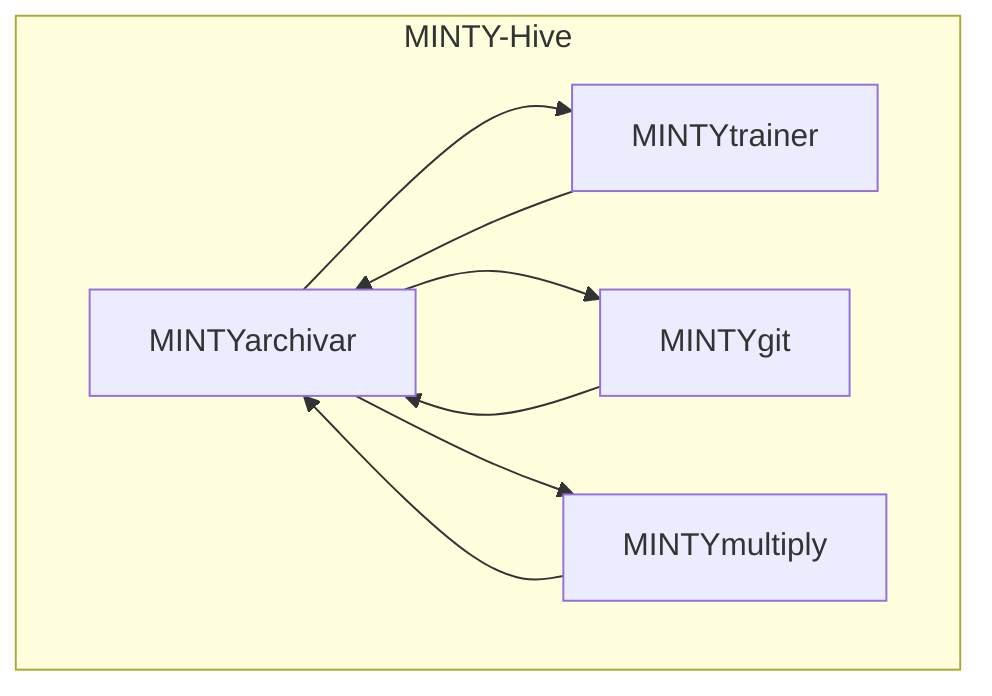
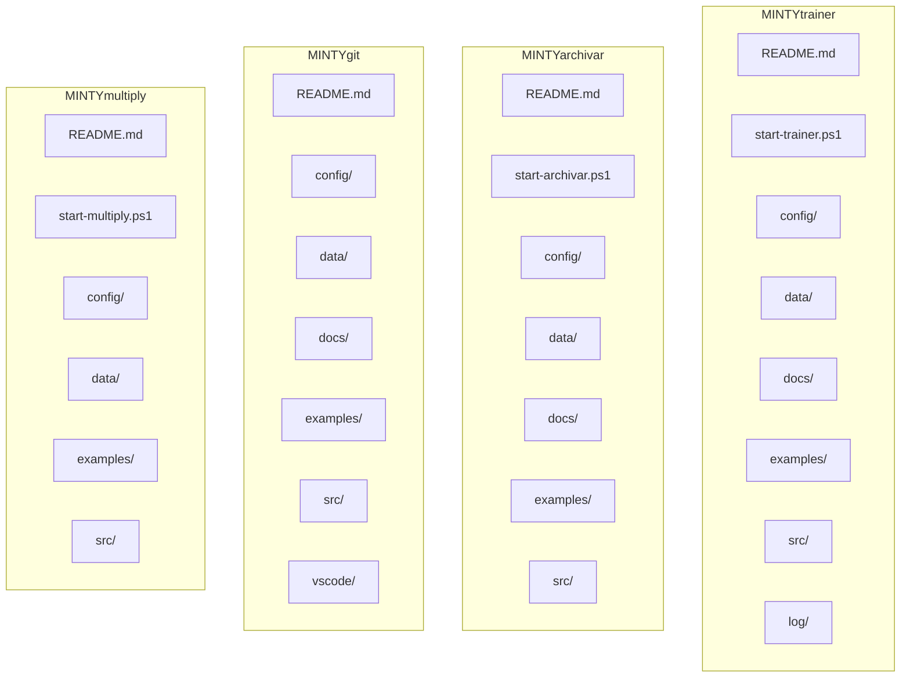
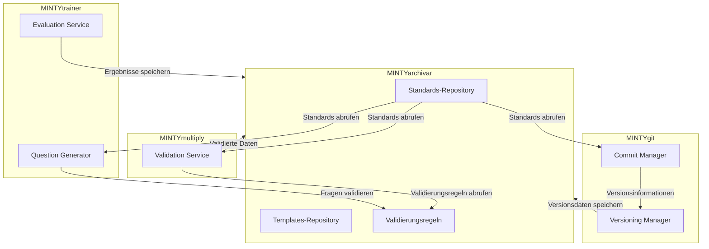
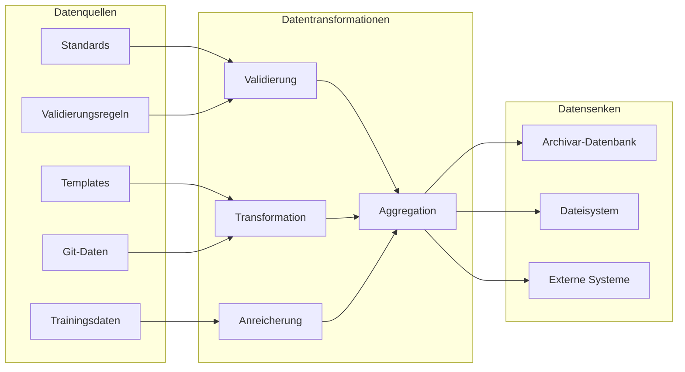
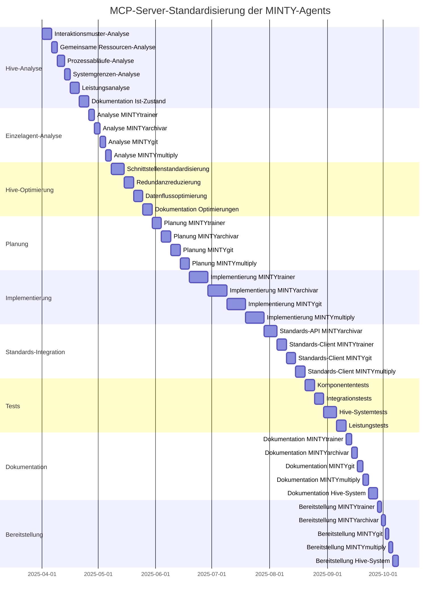

# Implementierungsplan für die MCP-Server-Standardisierung der MINTY-Agents

Dieser Plan beschreibt die Schritte zur Migration der bestehenden MINTY-Agents (MINTYtrainer, MINTYarchivar, MINTYgit, MINTYmultiply) zur standardisierten MCP-Server-Architektur. Alle Standards werden zentral im MINTYarchivar gespeichert und von dort abgerufen. Die Agents werden als gesamter Hive betrachtet, um ihre Funktionsweise und ihr Zusammenwirken zu optimieren.

## Übersicht

Die Migration wird in mehreren Phasen durchgeführt:

1. **Hive-Analyse**: Analyse des gesamten Agent-Hives, seiner Funktionsweise und des Zusammenwirkens der Agents
2. **Einzelagent-Analyse**: Bewertung des aktuellen Zustands jedes einzelnen Agents
3. **Hive-Optimierung**: Optimierung der Interaktionen zwischen den Agents
4. **Planung**: Detaillierte Planung der Migration basierend auf den Analyseergebnissen
5. **Implementierung**: Schrittweise Implementierung der MCP-Server-Architektur
6. **Standards-Integration**: Integration aller Agents mit MINTYarchivar für Standards
7. **Tests**: Umfassende Tests der migrierten Agents als Gesamtsystem
8. **Dokumentation**: Aktualisierung der Dokumentation
9. **Bereitstellung**: Bereitstellung der migrierten Agents als funktionierender Hive

## Phase 1: Hive-Analyse

### Analyse des Agent-Hives als Gesamtsystem



Die Hive-Analyse umfasst:

1. **Interaktionsmuster**: Analyse der Kommunikation und Datenflüsse zwischen den Agents
   - Welche Agents kommunizieren miteinander?
   - Welche Daten werden ausgetauscht?
   - Welche Abhängigkeiten bestehen?

2. **Gemeinsame Ressourcen**: Identifikation gemeinsam genutzter Ressourcen
   - Welche Daten werden von mehreren Agents genutzt?
   - Wie werden gemeinsame Ressourcen synchronisiert?

3. **Prozessabläufe**: Analyse der Prozessabläufe im Hive
   - Welche Geschäftsprozesse werden durch den Hive unterstützt?
   - Wie arbeiten die Agents zusammen, um diese Prozesse zu unterstützen?

4. **Systemgrenzen**: Identifikation der Systemgrenzen
   - Welche externen Systeme interagieren mit dem Hive?
   - Welche Schnittstellen werden genutzt?

5. **Leistungsanalyse**: Analyse der Leistung des Gesamtsystems
   - Wo liegen Engpässe?
   - Welche Optimierungspotenziale gibt es?

### Dokumentation des Ist-Zustands

Die Ergebnisse der Hive-Analyse werden in folgenden Dokumenten festgehalten:

1. **Interaktionsdiagramm**: Visualisierung der Kommunikation zwischen den Agents
2. **Datenflussdiagramm**: Visualisierung der Datenflüsse im Hive
3. **Prozessdiagramm**: Visualisierung der Geschäftsprozesse
4. **Schnittstellendokumentation**: Dokumentation der Schnittstellen zwischen den Agents
5. **Leistungsbericht**: Dokumentation der Leistungsanalyse

## Phase 2: Einzelagent-Analyse

### Aktuelle Struktur der Agents



### Funktionale Analyse der einzelnen Agents

#### MINTYtrainer
- **Hauptfunktionalität**: LLM-Finetuning durch Multiple-Choice-Fragen
- **Kernkomponenten**: QuestionGenerator, EvaluationService, InterfaceManager
- **Externe Schnittstellen**: Insight, Log, Revisor, Updater, FinetuningPipeline, User
- **Rolle im Hive**: Verbesserung der LLM-Qualität durch gezielte Trainingssamples

#### MINTYarchivar
- **Hauptfunktionalität**: Zentrale Verwaltung von Standards, Templates und Validierungsregeln für alle Agents
- **Kernkomponenten**: StandardManager, TemplateManager, ValidationManager, VersioningManager
- **Externe Schnittstellen**: Monitoring, Integration, Automation, Standards-API für andere Agents
- **Rolle im Hive**: Zentrale Quelle für Standards und Validierungsregeln

#### MINTYgit
- **Hauptfunktionalität**: Git-Integration und Versionierung
- **Kernkomponenten**: CommitManager, GitCommitStrategy, VersioningManager, VSCodeGitChecker
- **Externe Schnittstellen**: VSCode-Integration
- **Rolle im Hive**: Versionskontrolle und Code-Management

#### MINTYmultiply
- **Hauptfunktionalität**: Validierung und Multiplikation
- **Kernkomponenten**: ValidationService
- **Externe Schnittstellen**: Unbekannt (minimale Implementierung)
- **Rolle im Hive**: Validierung und Vervielfältigung von Inhalten

## Hive-Kommunikation und Datenflüsse

Die Kommunikation und Datenflüsse zwischen den Agents im Hive sind entscheidend für die Gesamtfunktionalität des Systems. Diese werden im Detail analysiert und optimiert.

### Kommunikationsmuster



#### Synchrone vs. Asynchrone Kommunikation

1. **Synchrone Kommunikation**:
   - Standards-Abruf: Agents rufen Standards synchron vom MINTYarchivar ab
   - Validierungsanfragen: Validierungsanfragen werden synchron verarbeitet
   - Beispiel: `GET /api/standards/folder_structure`

2. **Asynchrone Kommunikation**:
   - Event-basierte Benachrichtigungen: Änderungen an Standards lösen Events aus
   - Hintergrundprozesse: Langläufige Prozesse werden asynchron ausgeführt
   - Beispiel: `PUBLISH standards.updated {standardId: "folder_structure"}`

#### Kommunikationsprotokolle

1. **REST API**:
   - Primäres Protokoll für synchrone Anfragen
   - Standardisierte Endpunkte für alle Agents
   - Beispiel: `GET /api/standards/{standardId}`

2. **Event-Bus**:
   - Protokoll für asynchrone Kommunikation
   - Publish-Subscribe-Muster für Events
   - Beispiel: `SUBSCRIBE standards.updated`

3. **Direkte Methodenaufrufe**:
   - Für lokale Kommunikation innerhalb eines Prozesses
   - Effizient für häufige Aufrufe
   - Beispiel: `standardsClient.GetStandard("folder_structure")`

### Datenflüsse



#### Datenformate

1. **JSON**:
   - Primäres Format für Standards und Konfigurationen
   - Einfach zu validieren und zu transformieren
   - Beispiel:
     ```json
     {
       "standard": "folder_structure",
       "version": "1.0.0",
       "schema": { ... }
     }
     ```

2. **JSONL**:
   - Format für Trainingsdaten und Logs
   - Effizient für große Datenmengen
   - Beispiel:
     ```
     {"question": "...", "options": [...], "correct_option": 0}
     {"question": "...", "options": [...], "correct_option": 1}
     ```

3. **Binäre Daten**:
   - Format für effiziente Datenübertragung
   - Verwendet für große Dateien und Medien
   - Beispiel: Komprimierte Trainingsdaten

#### Datenfluss-Optimierungen

1. **Caching**:
   - Lokales Caching von häufig verwendeten Standards
   - Invalidierung bei Änderungen durch Events
   - Beispiel: In-Memory-Cache für Standards mit TTL

2. **Batching**:
   - Zusammenfassung mehrerer Anfragen zu einer Batch-Anfrage
   - Reduzierung des Kommunikations-Overheads
   - Beispiel: Batch-Validierung von mehreren Datensätzen

3. **Streaming**:
   - Streaming von großen Datenmengen
   - Verarbeitung von Daten während der Übertragung
   - Beispiel: Streaming von Trainingsdaten

### Fehlerbehandlung und Resilience

1. **Fehlerbehandlungsstrategien**:
   - Retry-Mechanismen für temporäre Fehler
   - Circuit Breaker für wiederkehrende Fehler
   - Fallback-Mechanismen für kritische Funktionen

2. **Monitoring und Logging**:
   - Zentrale Protokollierung aller Kommunikation
   - Metriken für Latenz und Fehlerraten
   - Alarme bei Kommunikationsproblemen

3. **Resilience-Muster**:
   - Timeout-Mechanismen für blockierende Anfragen
   - Bulkhead-Muster zur Isolation von Fehlern
   - Graceful Degradation bei Teilausfällen

## Phase 3: Hive-Optimierung

Basierend auf den Ergebnissen der Hive-Analyse und der Einzelagent-Analyse werden Optimierungen am Gesamtsystem vorgenommen:

### Optimierung der Interaktionen

1. **Standardisierung der Schnittstellen**: Entwicklung einheitlicher Schnittstellen für die Kommunikation zwischen den Agents
   ```mermaid
   graph TD
       subgraph Standardisierte Schnittstellen
           API[REST API]
           Events[Event-basierte Kommunikation]
           SharedData[Gemeinsame Datenstrukturen]
       end
   ```

2. **Reduzierung von Redundanzen**: Identifikation und Beseitigung redundanter Funktionalitäten
   - Zusammenführung ähnlicher Funktionen
   - Zentralisierung gemeinsamer Funktionalitäten

3. **Verbesserung der Datenflüsse**: Optimierung der Datenflüsse zwischen den Agents
   - Minimierung von Datenübertragungen
   - Optimierung von Datenformaten
   - Implementierung von Caching-Strategien
   - Einführung von Batching und Streaming
   - Implementierung von Fehlerbehandlungsstrategien

### Dokumentation der Optimierungen

Die Ergebnisse der Hive-Optimierung werden in folgenden Dokumenten festgehalten:

1. **Optimierungsplan**: Dokumentation der geplanten Optimierungen
2. **Schnittstellenspezifikation**: Spezifikation der standardisierten Schnittstellen
3. **Datenmodell**: Dokumentation des optimierten Datenmodells
4. **Kommunikationsprotokoll**: Dokumentation der Kommunikationsmuster und -protokolle
5. **Datenflussdiagramm**: Visualisierung der Datenflüsse im Hive

## Phase 2: Planung

### Gemeinsame Komponenten

Für alle Agents müssen folgende gemeinsame MCP-Server-Komponenten implementiert werden:

1. **MCP-Server-Implementierung**:
   - Server-Klasse
   - Request-Handler
   - Error-Handler

2. **Transport-Layer**:
   - Stdio-Transport
   - HTTP/SSE-Transport

3. **Konfiguration**:
   - MCP-Konfigurationsdatei
   - Server-Metadaten

### Agent-spezifische Komponenten

#### MINTYtrainer

**Tools**:
- `generate_questions`: Generiert Multiple-Choice-Fragen basierend auf Konzepten
- `evaluate_questions`: Bewertet Fragen mit Modell- oder Benutzerantworten
- `get_ambiguity_map`: Ruft die Ambiguitätskarte ab

**Ressourcen**:
- `questions`: Fragesammlungen
- `evaluation_results`: Bewertungsergebnisse
- `ambiguity_maps`: Ambiguitätskarten

**Migration der bestehenden Funktionalität**:
- QuestionGenerator → generate_questions Tool + questions Ressource
- EvaluationService → evaluate_questions Tool + evaluation_results Ressource
- InterfaceManager → MCP-Server-Schnittstellen

#### MINTYarchivar

**Tools**:
- `manage_standards`: Verwaltet Standards für alle Agents
- `get_standards`: Stellt Standards für andere Agents bereit
- `manage_templates`: Verwaltet Templates
- `validate_content`: Validiert Inhalte gegen Standards und Templates
- `version_content`: Versioniert Inhalte

**Ressourcen**:
- `standards`: Standarddefinitionen für alle Agents (zentrale Quelle)
- `templates`: Templatedefinitionen
- `validation_rules`: Validierungsregeln

**Migration der bestehenden Funktionalität**:
- StandardManager → manage_standards Tool + get_standards Tool + standards Ressource
- TemplateManager → manage_templates Tool + templates Ressource
- ValidationManager → validate_content Tool + validation_rules Ressource
- VersioningManager → version_content Tool

**Neue Funktionalität**:
- Standards-API für andere Agents
- JSON-basierte Standarddefinitionen
- Versionierung von Standards

#### MINTYgit

**Tools**:
- `commit_changes`: Führt Git-Commits durch
- `apply_strategy`: Wendet eine Commit-Strategie an
- `check_vscode`: Überprüft VSCode-Git-Status

**Ressourcen**:
- `commit_strategies`: Commit-Strategien
- `versioning_config`: Versionierungskonfiguration

**Migration der bestehenden Funktionalität**:
- CommitManager → commit_changes Tool
- GitCommitStrategy → apply_strategy Tool + commit_strategies Ressource
- VersioningManager → versioning_config Ressource
- VSCodeGitChecker → check_vscode Tool

#### MINTYmultiply

**Tools**:
- `validate_constraints`: Validiert Einschränkungen
- `multiply_content`: Multipliziert Inhalte basierend auf Einschränkungen

**Ressourcen**:
- `constraints`: Einschränkungsdefinitionen
- `multiplication_results`: Multiplikationsergebnisse

**Migration der bestehenden Funktionalität**:
- ValidationService → validate_constraints Tool + constraints Ressource

## Standards-Integration

Alle Agents müssen mit MINTYarchivar für Standards integriert werden. Dies erfolgt durch die Implementierung eines Standards-Clients in jedem Agent.

### Standards-Client

Der Standards-Client ist eine gemeinsame Komponente, die in allen Agents implementiert wird und für den Zugriff auf Standards im MINTYarchivar verantwortlich ist.

```powershell
# src/standards/StandardsClient.ps1
class StandardsClient {
    [string]$ArchivarEndpoint
    [string]$StandardsPath

    StandardsClient([string]$archivarEndpoint, [string]$standardsPath) {
        $this.ArchivarEndpoint = $archivarEndpoint
        $this.StandardsPath = $standardsPath
    }

    [PSCustomObject]GetStandard([string]$standardName) {
        $url = "$($this.ArchivarEndpoint)$($this.StandardsPath)/$standardName"

        try {
            $response = Invoke-RestMethod -Uri $url -Method Get
            return $response
        } catch {
            Write-Error "Failed to get standard '$standardName': $_"
            return $null
        }
    }

    [PSCustomObject[]]GetAllStandards() {
        $url = "$($this.ArchivarEndpoint)$($this.StandardsPath)"

        try {
            $response = Invoke-RestMethod -Uri $url -Method Get
            return $response
        } catch {
            Write-Error "Failed to get all standards: $_"
            return @()
        }
    }
}
```

### Standards-Format

Alle Standards werden in JSON-Format gespeichert und abgerufen. Ein Beispiel für einen Standard:

```json
{
  "name": "folder_structure",
  "version": "1.0.0",
  "description": "Standard folder structure for MINTY agents",
  "schema": {
    "type": "object",
    "properties": {
      "README.md": { "type": "file", "required": true },
      "start-[agent].ps1": { "type": "file", "required": true },
      "start-[agent]-server.ps1": { "type": "file", "required": true },
      "config": {
        "type": "directory",
        "required": true,
        "properties": {
          "[agent]_config.json": { "type": "file", "required": true },
          "mcp_config.json": { "type": "file", "required": true }
        }
      },
      "src": {
        "type": "directory",
        "required": true,
        "properties": {
          "MINTY[agent].ps1": { "type": "file", "required": true },
          "mcp": {
            "type": "directory",
            "required": true,
            "properties": {
              "server.ps1": { "type": "file", "required": true },
              "tools": { "type": "directory", "required": true },
              "resources": { "type": "directory", "required": true },
              "transport": { "type": "directory", "required": true }
            }
          },
          "services": { "type": "directory", "required": true },
          "standards": { "type": "directory", "required": true },
          "utils": { "type": "directory", "required": true }
        }
      }
    }
  }
}
```

### Integration in jedem Agent

Jeder Agent muss den Standards-Client integrieren und verwenden, um Standards abzurufen:

```powershell
# Beispiel für die Integration in einem Agent
$config = Get-Content -Path "$PSScriptRoot\config\mcp_config.json" -Raw | ConvertFrom-Json
$standardsClient = [StandardsClient]::new($config.archivar.endpoint, $config.archivar.standardsPath)

# Standard abrufen
$folderStructureStandard = $standardsClient.GetStandard("folder_structure")

# Standard verwenden
if ($folderStructureStandard) {
    # Implementierung basierend auf dem Standard
    # ...
}
```

## Phase 3: Implementierung

Die Implementierung erfolgt in mehreren Schritten für jeden Agent:

### Schritt 1: Grundlegende MCP-Server-Struktur

1. Erstellen der MCP-Verzeichnisstruktur:
   ```
   src/mcp/
   ├── server.ps1
   ├── tools/
   ├── resources/
   └── transport/
       ├── stdio.ps1
       └── http.ps1
   ```

2. Implementieren der grundlegenden MCP-Server-Klasse:
   ```powershell
   # src/mcp/server.ps1
   class MCPServer {
       [PSCustomObject]$Config
       [System.Collections.Hashtable]$Tools = @{}
       [System.Collections.Hashtable]$Resources = @{}
       [PSCustomObject]$Transport

       MCPServer([string]$configPath) {
           $this.Config = Get-Content -Path $configPath -Raw | ConvertFrom-Json
       }

       [void]RegisterTool([string]$name, [scriptblock]$handler) {
           $this.Tools[$name] = $handler
       }

       [void]RegisterResource([string]$uri, [scriptblock]$handler) {
           $this.Resources[$uri] = $handler
       }

       [void]Start() {
           # Initialize transport based on config
           if ($this.Config.transport.stdio.enabled) {
               $this.Transport = [StdioTransport]::new($this)
           } elseif ($this.Config.transport.http.enabled) {
               $this.Transport = [HttpTransport]::new($this)
           }

           # Start the transport
           $this.Transport.Start()
       }
   }
   ```

3. Implementieren der Transport-Layer:
   ```powershell
   # src/mcp/transport/stdio.ps1
   class StdioTransport {
       [MCPServer]$Server

       StdioTransport([MCPServer]$server) {
           $this.Server = $server
       }

       [void]Start() {
           # Read from stdin and write to stdout
           while ($true) {
               $line = [Console]::In.ReadLine()
               if (-not $line) { continue }

               try {
                   $request = $line | ConvertFrom-Json
                   $response = $this.HandleRequest($request)
                   [Console]::Out.WriteLine(($response | ConvertTo-Json -Compress))
               } catch {
                   # Handle error
                   $errorResponse = @{
                       jsonrpc = "2.0"
                       id = $request.id
                       error = @{
                           code = -32000
                           message = $_.Exception.Message
                       }
                   }
                   [Console]::Out.WriteLine(($errorResponse | ConvertTo-Json -Compress))
               }
           }
       }

       [PSCustomObject]HandleRequest([PSCustomObject]$request) {
           # Dispatch to appropriate handler
           # ...
       }
   }
   ```

### Schritt 2: Agent-spezifische Tools und Ressourcen

Für jeden Agent werden die spezifischen Tools und Ressourcen implementiert:

1. Implementieren der Tools:
   ```powershell
   # src/mcp/tools/[tool_name].ps1
   function Register-[ToolName]Tool {
       param (
           [Parameter(Mandatory = $true)]
           [MCPServer]$Server
       )

       $Server.RegisterTool("[tool_name]", {
           param (
               [Parameter(Mandatory = $true)]
               [PSCustomObject]$Request
           )

           # Tool implementation
           # ...

           return @{
               result = $result
           }
       })
   }
   ```

2. Implementieren der Ressourcen:
   ```powershell
   # src/mcp/resources/[resource_name].ps1
   function Register-[ResourceName]Resource {
       param (
           [Parameter(Mandatory = $true)]
           [MCPServer]$Server
       )

       $Server.RegisterResource("[resource_uri]", {
           param (
               [Parameter(Mandatory = $true)]
               [PSCustomObject]$Request
           )

           # Resource implementation
           # ...

           return @{
               content = $content
           }
       })
   }
   ```

### Schritt 3: Implementierung des Standards-Clients

Der Standards-Client wird in jedem Agent implementiert, um Standards vom MINTYarchivar abzurufen:

1. Erstellen der Standards-Verzeichnisstruktur:
   ```
   src/standards/
   ├── StandardsClient.ps1
   ```

2. Implementieren des Standards-Clients:
   ```powershell
   # src/standards/StandardsClient.ps1
   class StandardsClient {
       [string]$ArchivarEndpoint
       [string]$StandardsPath

       StandardsClient([string]$archivarEndpoint, [string]$standardsPath) {
           $this.ArchivarEndpoint = $archivarEndpoint
           $this.StandardsPath = $standardsPath
       }

       [PSCustomObject]GetStandard([string]$standardName) {
           $url = "$($this.ArchivarEndpoint)$($this.StandardsPath)/$standardName"

           try {
               $response = Invoke-RestMethod -Uri $url -Method Get
               return $response
           } catch {
               Write-Error "Failed to get standard '$standardName': $_"
               return $null
           }
       }

       [PSCustomObject[]]GetAllStandards() {
           $url = "$($this.ArchivarEndpoint)$($this.StandardsPath)"

           try {
               $response = Invoke-RestMethod -Uri $url -Method Get
               return $response
           } catch {
               Write-Error "Failed to get all standards: $_"
               return @()
           }
       }
   }
   ```

3. Integration des Standards-Clients in die Konfiguration:
   ```json
   // config/mcp_config.json
   {
     "archivar": {
       "endpoint": "http://localhost:3001",
       "standardsPath": "/api/standards"
     }
   }
   ```

### Schritt 4: Integration der bestehenden Funktionalität

Die bestehende Funktionalität wird in die MCP-Server-Architektur integriert, mit Unterstützung für Standards:

1. Refactoring der bestehenden Dienste mit Standards-Integration:
   ```powershell
   # src/services/[Service].ps1
   class [Service] {
       [StandardsClient]$StandardsClient

       [Service]([StandardsClient]$standardsClient) {
           $this.StandardsClient = $standardsClient
       }

       # Service implementation mit Standards-Unterstützung
       # ...
   }
   ```

2. Verwendung der Dienste in den Tools und Ressourcen:
   ```powershell
   # src/mcp/tools/[tool_name].ps1
   function Register-[ToolName]Tool {
       param (
           [Parameter(Mandatory = $true)]
           [MCPServer]$Server,

           [Parameter(Mandatory = $true)]
           [StandardsClient]$StandardsClient
       )

       $Server.RegisterTool("[tool_name]", {
           param (
               [Parameter(Mandatory = $true)]
               [PSCustomObject]$Request
           )

           # Create service instance with standards client
           $service = [Service]::new($StandardsClient)

           # Use service
           $result = $service.DoSomething($Request.params)

           return @{
               result = $result
           }
       })
   }
   ```

### Schritt 5: Startskripte

1. Implementieren des Stdio-Startskripts mit Standards-Client:
   ```powershell
   # start-[agent].ps1
   param (
       [string]$ConfigPath = "$PSScriptRoot\config\mcp_config.json"
   )

   # Import required modules
   Import-Module "$PSScriptRoot\src\mcp\server.ps1" -Force
   Import-Module "$PSScriptRoot\src\mcp\transport\stdio.ps1" -Force
   Import-Module "$PSScriptRoot\src\standards\StandardsClient.ps1" -Force

   # Import tools and resources
   Get-ChildItem -Path "$PSScriptRoot\src\mcp\tools\*.ps1" | ForEach-Object { Import-Module $_.FullName -Force }
   Get-ChildItem -Path "$PSScriptRoot\src\mcp\resources\*.ps1" | ForEach-Object { Import-Module $_.FullName -Force }

   # Create and start server
   $server = [MCPServer]::new($ConfigPath)

   # Create standards client
   $config = Get-Content -Path $ConfigPath -Raw | ConvertFrom-Json
   $standardsClient = [StandardsClient]::new($config.archivar.endpoint, $config.archivar.standardsPath)

   # Register tools and resources with standards client
   Register-[Tool1]Tool -Server $server -StandardsClient $standardsClient
   Register-[Tool2]Tool -Server $server -StandardsClient $standardsClient
   Register-[Resource1]Resource -Server $server -StandardsClient $standardsClient
   Register-[Resource2]Resource -Server $server -StandardsClient $standardsClient

   # Start server
   $server.Start()
   ```

2. Implementieren des HTTP-Startskripts mit Standards-Client:
   ```powershell
   # start-[agent]-server.ps1
   param (
       [string]$ConfigPath = "$PSScriptRoot\config\mcp_config.json"
   )

   # Import required modules
   Import-Module "$PSScriptRoot\src\mcp\server.ps1" -Force
   Import-Module "$PSScriptRoot\src\mcp\transport\http.ps1" -Force
   Import-Module "$PSScriptRoot\src\standards\StandardsClient.ps1" -Force

   # Import tools and resources
   Get-ChildItem -Path "$PSScriptRoot\src\mcp\tools\*.ps1" | ForEach-Object { Import-Module $_.FullName -Force }
   Get-ChildItem -Path "$PSScriptRoot\src\mcp\resources\*.ps1" | ForEach-Object { Import-Module $_.FullName -Force }

   # Create and start server
   $server = [MCPServer]::new($ConfigPath)

   # Create standards client
   $config = Get-Content -Path $ConfigPath -Raw | ConvertFrom-Json
   $standardsClient = [StandardsClient]::new($config.archivar.endpoint, $config.archivar.standardsPath)

   # Register tools and resources with standards client
   Register-[Tool1]Tool -Server $server -StandardsClient $standardsClient
   Register-[Tool2]Tool -Server $server -StandardsClient $standardsClient
   Register-[Resource1]Resource -Server $server -StandardsClient $standardsClient
   Register-[Resource2]Resource -Server $server -StandardsClient $standardsClient

   # Start server
   $server.Start()
   ```

## Phase 4: Tests

Für jeden Agent werden umfassende Tests durchgeführt:

1. **Unit-Tests**: Tests für einzelne Komponenten
2. **Integrationstests**: Tests für die Interaktion zwischen Komponenten
3. **End-to-End-Tests**: Tests für den gesamten Agent

```powershell
# tests/unit/[component]_tests.ps1
Describe "[Component] Tests" {
    BeforeAll {
        # Setup
    }

    It "Should do something" {
        # Test
        $result = [Component]::DoSomething()
        $result | Should -Be "expected result"
    }

    AfterAll {
        # Cleanup
    }
}
```

## Phase 5: Dokumentation

Die Dokumentation wird aktualisiert:

1. **README.md**: Übersicht und Installation
2. **api.md**: API-Dokumentation
3. **Inline-Kommentare**: Implementierungsdetails

## Phase 6: Bereitstellung

Die migrierten Agents werden bereitgestellt:

1. **Lokale Bereitstellung**: Bereitstellung als lokale Prozesse
2. **Server-Bereitstellung**: Bereitstellung als HTTP-Server

## Zeitplan



## Risiken und Abhängigkeiten

### Risiken

1. **Kompatibilitätsprobleme**: Die bestehende Funktionalität könnte nicht vollständig mit der MCP-Server-Architektur kompatibel sein.
2. **Leistungsprobleme**: Die MCP-Server-Architektur könnte zu Leistungsproblemen führen.
3. **Komplexität**: Die MCP-Server-Architektur könnte die Komplexität der Agents erhöhen.
4. **Zentralisierungsrisiko**: Die Abhängigkeit aller Agents von MINTYarchivar für Standards könnte zu einem Single Point of Failure führen.
5. **Versionierungskonflikte**: Änderungen an Standards könnten zu Inkompatibilitäten zwischen Agents führen.

### Abhängigkeiten

1. **MCP-SDK**: Die Implementierung hängt von der Verfügbarkeit eines MCP-SDK für PowerShell ab.
2. **Externe Schnittstellen**: Die Migration könnte Änderungen an externen Schnittstellen erfordern.
3. **MINTYarchivar-Verfügbarkeit**: Alle Agents sind von der Verfügbarkeit des MINTYarchivar für Standards abhängig.
4. **JSON-Schema-Validierung**: Die Standards-Integration erfordert eine zuverlässige JSON-Schema-Validierung.

## Nächste Schritte

1. **Hive-Analyse**: Analyse des gesamten Agent-Hives und seiner Interaktionen
   - Dokumentation der Kommunikationsmuster zwischen Agents
   - Identifikation gemeinsam genutzter Ressourcen
   - Analyse der Prozessabläufe im Hive
   - Identifikation von Optimierungspotentialen

2. **Einzelagent-Analyse**: Detaillierte Analyse jedes einzelnen Agents
   - Analyse der Funktionalität
   - Analyse der Schnittstellen
   - Analyse der Datenstrukturen

3. **Hive-Optimierung**: Optimierung der Interaktionen im Hive
   - Standardisierung der Schnittstellen
   - Reduzierung von Redundanzen
   - Optimierung der Datenflüsse

4. **Standards-Definition**: Definition der Standards im JSON-Format für MINTYarchivar
   - Definition von Ordnerstruktur-Standards
   - Definition von Schnittstellen-Standards
   - Definition von Datenformat-Standards

5. **MINTYarchivar-Erweiterung**: Implementierung der Standards-API in MINTYarchivar
   - Implementierung der Standards-Verwaltung
   - Implementierung der Standards-Validierung
   - Implementierung der Standards-Verteilung

6. **Prototyp**: Implementierung eines Prototyps für einen Agent mit Standards-Integration
   - Implementierung der MCP-Server-Architektur
   - Implementierung der Standards-Client-Integration
   - Implementierung der Hive-Interaktionen

7. **Feedback**: Einholung von Feedback zum Prototyp
   - Feedback zur Funktionalität
   - Feedback zur Leistung
   - Feedback zur Benutzerfreundlichkeit

8. **Anpassung**: Anpassung des Plans basierend auf dem Feedback
   - Anpassung der Standards
   - Anpassung der Schnittstellen
   - Anpassung der Implementierung

9. **Implementierung**: Implementierung des Plans für alle Agents als funktionierender Hive
   - Implementierung der MCP-Server-Architektur
   - Implementierung der Standards-Integration
   - Implementierung der Hive-Interaktionen
